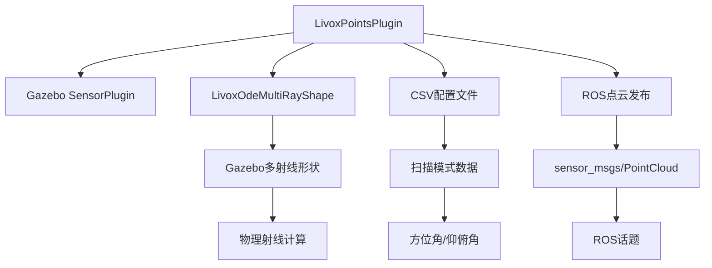

# Livox_Laser_Simulation 模块详细分析报告

## 1. 项目概述

`livox_laser_simulation` 是一个专门为**Livox系列激光雷达**设计的Gazebo仿真插件包，为Livox LiDAR在仿真环境中提供高保真度的激光雷达数据仿真功能。该插件能够精确模拟Livox激光雷达的独特扫描模式和点云输出特性。

### 模块定位
- **架构层级**: 第4层 - 独立功能层
- **耦合度**: 🟢 **低耦合** - 相对独立的传感器仿真
- **重要性**: 🟡 **专用仿真组件**

## 2. 目录结构分析

```
livox_laser_simulation/
├── src/                                # 源代码目录
│   ├── livox_points_plugin.cpp         # 核心插件实现
│   └── livox_ode_multiray_shape.cpp    # 多射线形状实现
├── include/                            # 头文件目录
│   └── livox_laser_simulation/
│       ├── livox_points_plugin.h       # 插件头文件
│       ├── livox_ode_multiray_shape.h  # 多射线形状头文件
│       └── csv_reader.hpp              # CSV读取工具
├── urdf/                               # URDF模型定义
│   ├── livox_avia.xacro                # Avia激光雷达模型
│   ├── livox_HAP.xacro                 # HAP激光雷达模型
│   ├── livox_horizon.xacro             # Horizon激光雷达模型
│   ├── livox_mid40.xacro               # Mid-40激光雷达模型
│   ├── livox_mid70.xacro               # Mid-70激光雷达模型
│   ├── livox_mid360.xacro              # Mid-360激光雷达模型
│   ├── livox_tele.xacro                # Tele激光雷达模型
│   └── standardrobots_oasis300.xacro   # 移动平台模型
├── scan_mode/                          # 扫描模式配置
│   ├── avia.csv                        # Avia扫描模式
│   ├── HAP.csv                         # HAP扫描模式
│   ├── horizon.csv                     # Horizon扫描模式
│   ├── mid40.csv                       # Mid-40扫描模式
│   ├── mid70.csv                       # Mid-70扫描模式
│   ├── mid360.csv                      # Mid-360扫描模式
│   └── tele.csv                        # Tele扫描模式
├── meshes/                             # 3D网格模型
│   └── livox_mid40.dae                 # Mid-40 3D模型
├── launch/                             # 启动文件
│   └── livox_simulation.launch         # 仿真启动文件
├── rviz/                               # 可视化配置
│   └── livox_simulation.rviz           # RViz配置文件
├── worlds/                             # 仿真世界文件
│   └── stairs.world                    # 阶梯环境世界
├── resources/                          # 演示资源
│   ├── avia.gif                        # Avia演示动图
│   ├── mid40.gif                       # Mid-40演示动图
│   ├── mid70.gif                       # Mid-70演示动图
│   ├── tele.gif                        # Tele演示动图
│   └── horizon.gif                     # Horizon演示动图
├── CMakeLists.txt                      # 编译配置
├── package.xml                         # ROS包配置
├── LICENSE                             # MIT许可证
└── README.md                           # 使用文档
```

## 3. 核心技术架构

### 3.1 Gazebo插件架构

#### 插件继承结构
```cpp
class LivoxPointsPlugin : public gazebo::SensorPlugin {
    // 继承自Gazebo传感器插件基类
    // 实现Livox特有的点云生成逻辑
};
```

#### 核心组件关系


### 3.2 Livox扫描模式仿真

#### 非重复扫描模式(Non-repetitive Scanning)
Livox激光雷达的独特之处在于其**非重复扫描模式**，与传统旋转式激光雷达不同：

```cpp
struct AviaRotateInfo {
    double time;     // 时间戳
    double azimuth;  // 方位角 (水平角度)
    double zenith;   // 仰俯角 (垂直角度)
};
```

#### CSV配置文件格式
```csv
# 时间(s), 方位角(度), 仰俯角(度)
0.000000, -30.123, 5.456
0.000001, -28.987, 3.234
0.000002, -31.567, 7.891
...
```

## 4. 支持的激光雷达型号

### 4.1 型号对比表

| 型号 | 视场角(FOV) | 点频率 | 测距范围 | 典型应用 |
|------|-------------|--------|----------|----------|
| **Avia** | 70.4°×77.2° | 240,000 pts/s | 0.1-200m | 自动驾驶 |
| **Mid-40** | 38.4°×38.4° | 100,000 pts/s | 0.1-260m | 机器人/无人机 |
| **Mid-70** | 70.4°×4.5° | 100,000 pts/s | 0.1-260m | 机器人/测绘 |
| **Mid-360** | 360°×59° | 200,000 pts/s | 0.1-200m | 机器人/安防 |
| **Horizon** | 81.7°×25.1° | 240,000 pts/s | 0.1-260m | 自动驾驶 |
| **Tele-15** | 14.5°×16.2° | 240,000 pts/s | 3-500m | 长距离探测 |
| **HAP** | 120°×25° | 480,000 pts/s | 0.1-200m | 高精度应用 |

### 4.2 配置参数示例

#### Avia配置 (livox_avia.xacro)
```xml
<xacro:property name="horizontal_fov" value="70.4"/>  <!-- 水平视场角 -->
<xacro:property name="vertical_fov" value="77.2"/>    <!-- 垂直视场角 -->
<xacro:property name="samples" value="24000"/>        <!-- 每扫描周期点数 -->
<xacro:property name="laser_min_range" value="0.1"/>  <!-- 最小测距 -->
<xacro:property name="laser_max_range" value="200.0"/><!-- 最大测距 -->
<xacro:property name="downsample" value="1"/>         <!-- 降采样率 -->
<xacro:property name="ros_topic" value="scan"/>       <!-- ROS话题名 -->
```

#### Mid-40配置 (livox_mid40.xacro)
```xml
<xacro:property name="horizontal_fov" value="38.4"/>
<xacro:property name="vertical_fov" value="38.4"/>
<xacro:property name="samples" value="10000"/>
<xacro:property name="csv_file_name" value="package://livox_laser_simulation/scan_mode/mid40.csv"/>
```

## 5. 插件核心实现

### 5.1 初始化流程

#### 插件加载过程
```cpp
void LivoxPointsPlugin::Load(gazebo::sensors::SensorPtr _parent, sdf::ElementPtr sdf) {
    // 1. 读取CSV扫描模式文件
    std::string file_name = sdf->Get<std::string>("csv_file_name");
    std::vector<std::vector<double>> datas;
    CsvReader::ReadCsvFile(file_name, datas);
    
    // 2. 转换为内部数据结构
    convertDataToRotateInfo(datas, aviaInfos);
    
    // 3. 初始化Gazebo传感器
    rayShape = boost::dynamic_pointer_cast<physics::LivoxOdeMultiRayShape>(
        laserCollision->GetShape());
    
    // 4. 设置ROS发布器
    rosPointPub = rosNode.advertise<sensor_msgs::PointCloud>(rosTopic, 1);
}
```

#### 数据转换函数
```cpp
void convertDataToRotateInfo(const std::vector<std::vector<double>> &datas, 
                           std::vector<AviaRotateInfo> &avia_infos) {
    double deg_2_rad = M_PI / 180.0;
    for (auto &data : datas) {
        avia_infos.emplace_back();
        avia_infos.back().time = data[0];
        avia_infos.back().azimuth = data[1] * deg_2_rad;    // 转换为弧度
        avia_infos.back().zenith = data[2] * deg_2_rad - M_PI_2;  // 标准右手系
    }
}
```

### 5.2 射线计算和点云生成

#### 射线初始化
```cpp
void LivoxPointsPlugin::InitializeRays(std::vector<std::pair<int, AviaRotateInfo>> &points_pair,
                                      boost::shared_ptr<physics::LivoxOdeMultiRayShape> &ray_shape) {
    auto &rays = ray_shape->RayShapes();
    ignition::math::Vector3d start_point, end_point;
    ignition::math::Quaterniond ray;
    
    // 遍历当前扫描周期的点
    for (int k = currStartIndex; k < end_index; k += downSample) {
        auto index = k % maxPointSize;
        auto &rotate_info = aviaInfos[index];
        
        // 计算射线方向
        ray.Euler(ignition::math::Vector3d(0.0, rotate_info.zenith, rotate_info.azimuth));
        auto axis = offset.Rot() * ray * ignition::math::Vector3d(1.0, 0.0, 0.0);
        
        // 设置射线起点和终点
        start_point = minDist * axis + offset.Pos();
        end_point = maxDist * axis + offset.Pos();
        rays[ray_index]->SetPoints(start_point, end_point);
    }
}
```

#### 点云数据生成
```cpp
void LivoxPointsPlugin::OnNewLaserScans() {
    std::vector<ignition::math::Vector3d> scan_points;
    
    // 计算每个射线的击中点
    for (auto &pair : points_pair) {
        auto range = pair.first;
        auto rotate_info = pair.second;
        
        // 转换为世界坐标系点云
        ignition::math::Quaterniond ray;
        ray.Euler(ignition::math::Vector3d(0.0, rotate_info.zenith, rotate_info.azimuth));
        auto axis = ray * ignition::math::Vector3d(1.0, 0.0, 0.0);
        auto point = range * axis;
        
        scan_points.emplace_back();
        scan_points.back().x = point.X();
        scan_points.back().y = point.Y();
        scan_points.back().z = point.Z();
    }
    
    // 发布ROS点云消息
    rosPointPub.publish(scan_point);
}
```

### 5.3 噪声模型

#### 高斯噪声仿真
```xml
<noise>
    <type>gaussian</type>
    <mean>0.0</mean>        <!-- 噪声均值 -->
    <stddev>0.008</stddev>  <!-- 标准差(8mm) -->
</noise>
```

#### 真实传感器特性
- **距离精度**: ±2cm (典型值)
- **角度分辨率**: 0.1°-0.28° (因型号而异)
- **反射率依赖**: 模拟不同材质的反射特性

## 6. URDF集成和使用

### 6.1 在机器人中集成

#### 添加Livox传感器到机器人
```xml
<!-- 在机器人URDF中添加Livox传感器 -->
<link name="laser_livox">
    <visual>
        <geometry>
            <mesh filename="package://livox_laser_simulation/meshes/livox_mid40.dae"/>
        </geometry>
    </visual>
    <collision>
        <geometry>
            <mesh filename="package://livox_laser_simulation/meshes/livox_mid40.dae"/>
        </geometry>
    </collision>
</link>

<joint name="laser_livox_joint" type="fixed">
    <origin xyz="0.23 0 0.11" rpy="0 0 0"/>
    <parent link="base"/>
    <child link="laser_livox"/>
</joint>
```

#### Gazebo插件配置
```xml
<gazebo reference="laser_livox">
    <sensor type="ray" name="laser_livox">
        <pose>0 0 0 0 0 0</pose>
        <visualize>true</visualize>
        <update_rate>10</update_rate>
        
        <plugin name="gazebo_ros_laser_controller" filename="liblivox_laser_simulation.so">
            <samples>24000</samples>
            <downsample>1</downsample>
            <csv_file_name>package://livox_laser_simulation/scan_mode/avia.csv</csv_file_name>
            <ros_topic>points_raw</ros_topic>
        </plugin>
    </sensor>
</gazebo>
```

### 6.2 启动和测试

#### 基础仿真启动
```bash
# 启动Livox激光雷达仿真
roslaunch livox_laser_simulation livox_simulation.launch

# 选择不同的激光雷达型号
roslaunch livox_laser_simulation livox_simulation.launch \
    livox_sensor:=$(find livox_laser_simulation)/urdf/livox_avia.xacro

# 使用自定义世界文件
roslaunch livox_laser_simulation livox_simulation.launch \
    world:=$(find my_package)/worlds/my_world.world
```

#### 参数调整
```xml
<!-- 在launch文件中调整参数 -->
<param name="livox_samples" value="12000"/>      <!-- 降低点云密度 -->
<param name="livox_downsample" value="2"/>       <!-- 增加降采样 -->
<param name="livox_update_rate" value="20"/>     <!-- 提高更新频率 -->
```

## 7. 性能优化和配置

### 7.1 性能调优参数

#### 计算性能优化
```xml
<!-- 性能优化配置 -->
<samples>12000</samples>        <!-- 减少每次扫描点数 -->
<downsample>2</downsample>      <!-- 增加降采样率 -->
<update_rate>5</update_rate>    <!-- 降低更新频率 -->
```

#### 质量vs性能权衡
| 配置级别 | samples | downsample | update_rate | 性能影响 | 质量影响 |
|----------|---------|------------|-------------|----------|----------|
| **高质量** | 24000 | 1 | 10Hz | 🔴 高CPU | ✅ 高精度 |
| **平衡** | 12000 | 2 | 10Hz | 🟡 中CPU | 🟡 中精度 |
| **高性能** | 6000 | 4 | 5Hz | 🟢 低CPU | ⚠️ 低精度 |

### 7.2 内存和CPU优化

#### 射线数量优化
```cpp
// 动态调整射线数量
int optimal_ray_count = std::min(samples / downsample, MAX_RAY_COUNT);
ray_shape->SetRayCount(optimal_ray_count);
```

#### 缓存机制
```cpp
// CSV数据缓存，避免重复读取
static std::map<std::string, std::vector<AviaRotateInfo>> csv_cache;
if (csv_cache.find(file_name) == csv_cache.end()) {
    // 首次读取并缓存
    std::vector<std::vector<double>> datas;
    CsvReader::ReadCsvFile(file_name, datas);
    convertDataToRotateInfo(datas, csv_cache[file_name]);
}
```

## 8. 与其他模块的集成

### 8.1 在Unitree项目中的使用

#### 与Go2机器人集成
```xml
<!-- 在go2_description中集成Livox -->
<xacro:include filename="$(find livox_laser_simulation)/urdf/livox_mid360.xacro"/>

<!-- 添加到机器人身体上 -->
<xacro:Livox_Mid360 name="head_lidar" visualize="true"/>
<joint name="lidar_mount" type="fixed">
    <origin xyz="0.23 0 0.11" rpy="0 0 0"/>
    <parent link="base"/>
    <child link="head_lidar_base"/>
</joint>
```

#### 与FAST-LIO配合
```yaml
# FAST-LIO配置文件适配Livox
lidar_topic: "/points_raw"      # Livox点云话题
point_filter_num: 3            # 点云滤波
feature_extract_enable: false  # 关闭特征提取(Livox直接使用原始点云)
```

### 8.2 数据流集成

#### 点云数据流
```mermaid
graph LR
    A[Livox仿真插件] --> B[/points_raw]
    B --> C[FAST-LIO]
    C --> D[里程计/odom]
    C --> E[处理后点云]
    E --> F[导航系统]
    F --> G[路径规划]
```

#### ROS话题映射
```xml
<!-- 重映射Livox话题 -->
<remap from="/points_raw" to="/livox/lidar"/>
<remap from="/scan" to="/livox/scan"/>
```

## 9. 扩展开发指南

### 9.1 添加新的激光雷达型号

#### 步骤1: 创建CSV扫描模式
```csv
# 新型号扫描模式 new_model.csv
# 时间(s), 方位角(度), 仰俯角(度)
0.000000, -45.0, 10.0
0.000001, -43.2, 8.5
...
```

#### 步骤2: 创建URDF模型
```xml
<!-- livox_new_model.xacro -->
<xacro:macro name="Livox_NewModel" params="visualize:=True name:=livox">
    <!-- 物理模型定义 -->
    <link name="${name}_base">
        <visual>
            <geometry>
                <mesh filename="package://livox_laser_simulation/meshes/new_model.dae"/>
            </geometry>
        </visual>
    </link>
    
    <!-- Gazebo传感器配置 -->
    <gazebo reference="${name}">
        <plugin name="gazebo_ros_laser_controller" filename="liblivox_laser_simulation.so">
            <csv_file_name>package://livox_laser_simulation/scan_mode/new_model.csv</csv_file_name>
            <samples>15000</samples>
            <ros_topic>new_model_points</ros_topic>
        </plugin>
    </gazebo>
</xacro:macro>
```

### 9.2 自定义扫描模式

#### 生成工具脚本
```python
#!/usr/bin/env python3
import numpy as np
import csv

def generate_custom_scan_pattern(filename, 
                                horizontal_fov=60, 
                                vertical_fov=45, 
                                point_density=1000):
    """生成自定义扫描模式"""
    points = []
    
    # 玫瑰线扫描模式示例
    for i in range(point_density):
        t = 2 * np.pi * i / point_density
        r = np.sin(4 * t)  # 四瓣玫瑰线
        
        azimuth = horizontal_fov * r * np.cos(t)
        zenith = vertical_fov * r * np.sin(t)
        time = t / (2 * np.pi)
        
        points.append([time, azimuth, zenith])
    
    # 保存为CSV
    with open(filename, 'w', newline='') as f:
        writer = csv.writer(f)
        writer.writerows(points)

# 使用示例
generate_custom_scan_pattern('custom_pattern.csv')
```

### 9.3 高级功能扩展

#### 动态扫描模式切换
```cpp
class AdvancedLivoxPlugin : public LivoxPointsPlugin {
public:
    void SwitchScanMode(const std::string& new_mode) {
        // 运行时切换扫描模式
        std::string new_csv = "package://livox_laser_simulation/scan_mode/" + new_mode + ".csv";
        LoadCSVFile(new_csv);
        ReinitializeRays();
    }
    
private:
    void LoadCSVFile(const std::string& filename);
    void ReinitializeRays();
};
```

#### 多激光雷达融合
```xml
<!-- 多Livox激光雷达配置 -->
<xacro:Livox_Mid40 name="lidar_front" visualize="true"/>
<xacro:Livox_Mid40 name="lidar_back" visualize="true"/>

<joint name="front_lidar_joint" type="fixed">
    <origin xyz="0.3 0 0.1" rpy="0 0 0"/>
    <parent link="base"/>
    <child link="lidar_front_base"/>
</joint>

<joint name="back_lidar_joint" type="fixed">
    <origin xyz="-0.3 0 0.1" rpy="0 0 3.14159"/>
    <parent link="base"/>
    <child link="lidar_back_base"/>
</joint>
```

## 10. 故障排除和调试

### 10.1 常见问题及解决方案

#### 问题1: 插件加载失败
```bash
# 错误信息
[ERROR] Could not load plugin 'liblivox_laser_simulation.so'

# 解决方案
# 1. 检查编译是否成功
catkin_make
source devel/setup.bash

# 2. 检查库文件路径
export GAZEBO_PLUGIN_PATH=$GAZEBO_PLUGIN_PATH:$PWD/devel/lib
```

#### 问题2: CSV文件读取错误
```bash
# 错误信息
[ERROR] cannot get csv file! package://livox_laser_simulation/scan_mode/avia.csv

# 解决方案
# 1. 检查文件路径
rospack find livox_laser_simulation
ls $(rospack find livox_laser_simulation)/scan_mode/

# 2. 检查文件权限
chmod 644 scan_mode/*.csv
```

#### 问题3: 点云数据异常
```cpp
// 调试代码：检查点云数据
void LivoxPointsPlugin::OnNewLaserScans() {
    ROS_INFO_STREAM("Generated " << scan_points.size() << " points");
    ROS_INFO_STREAM("Range: [" << minDist << ", " << maxDist << "]");
    
    // 检查数据有效性
    for (const auto& point : scan_points) {
        if (std::isnan(point.x) || std::isnan(point.y) || std::isnan(point.z)) {
            ROS_WARN("Invalid point detected!");
        }
    }
}
```

### 10.2 性能分析

#### CPU使用率监控
```bash
# 监控Gazebo进程CPU使用
top -p $(pgrep gzserver)

# 使用perf分析性能热点
sudo perf record -g roslaunch livox_laser_simulation livox_simulation.launch
sudo perf report
```

#### 内存泄漏检测
```bash
# 使用valgrind检测内存泄漏
valgrind --leak-check=full --show-leak-kinds=all \
    roslaunch livox_laser_simulation livox_simulation.launch
```

## 11. 版本兼容性

### 11.1 支持的软件版本

#### 基础环境要求
- **Ubuntu**: 18.04/20.04
- **ROS**: Melodic/Noetic
- **Gazebo**: 9.x/11.x
- **C++标准**: C++17

#### Gazebo版本适配
```cmake
# CMakeLists.txt中的版本检查
if(${gazebo_VERSION_MAJOR} EQUAL 7)
    include_directories(/usr/include/gazebo-7/gazebo)
elseif(${gazebo_VERSION_MAJOR} EQUAL 9)
    include_directories(/usr/include/gazebo-9/gazebo)
elseif(${gazebo_VERSION_MAJOR} EQUAL 11)
    include_directories(/usr/include/gazebo-11/gazebo)
endif()
```

### 11.2 升级迁移指南

#### 从Gazebo 7升级到Gazebo 9
```bash
# 1. 检出适配分支
git checkout gazebo9

# 2. 更新依赖
sudo apt update
sudo apt install gazebo9-dev

# 3. 重新编译
catkin_make clean
catkin_make
```

## 12. 总结

`livox_laser_simulation` 模块具有以下核心价值：

### 12.1 技术优势
1. **高保真仿真**: 精确模拟Livox激光雷达的非重复扫描模式
2. **多型号支持**: 覆盖Livox全系列产品线
3. **灵活配置**: 支持自定义扫描模式和参数调整
4. **性能优化**: 提供多级性能配置选项
5. **易于集成**: 标准的Gazebo插件接口，便于集成到机器人系统

### 12.2 应用价值
1. **仿真验证**: 为基于Livox激光雷达的算法提供仿真验证平台
2. **算法开发**: 支持SLAM、导航等算法的快速迭代开发
3. **系统测试**: 在仿真环境中测试完整的机器人导航系统
4. **教育培训**: 为激光雷达技术学习提供实践平台

### 12.3 发展方向
该仿真插件为Livox激光雷达在机器人和自动驾驶领域的应用提供了重要的仿真支撑，随着Livox技术的不断发展和新产品的推出，该仿真插件也将持续更新和完善。