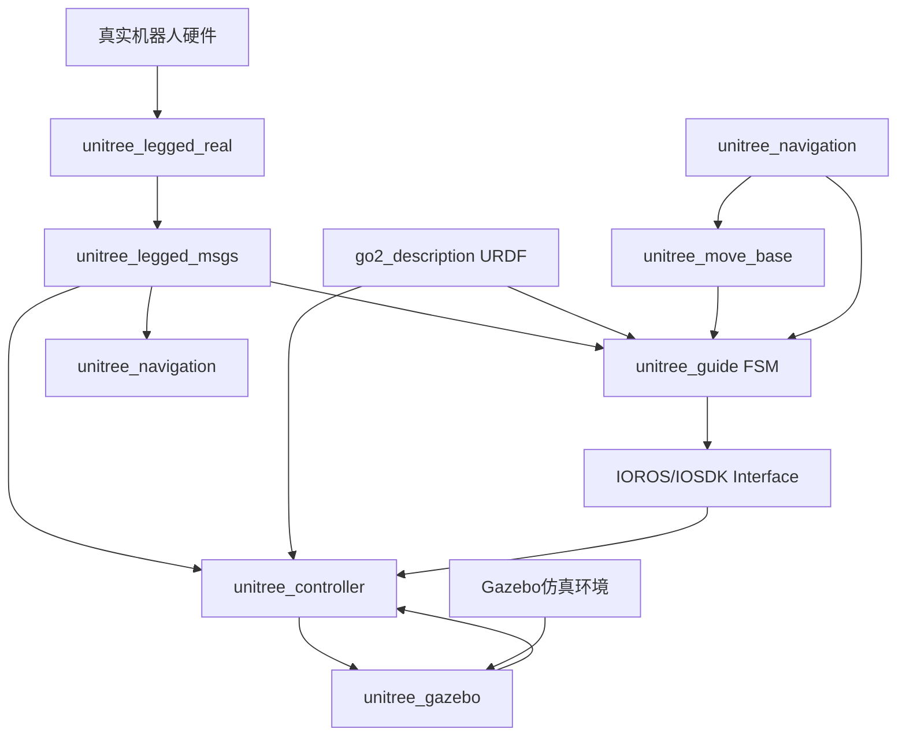

# Unitree_Guide 模块详细分析报告

## 1. 项目概述

`unitree_guide` 是 Unitree 四足机器人的**核心控制框架**，采用**有限状态机（FSM）架构**设计，为四足机器人提供完整的运动控制解决方案。它是整个项目中最重要的模块之一，负责机器人的行为决策和动作执行。

### 模块定位
- **架构层级**: 第5层 - 导航规划层
- **耦合度**: 🔴 **高耦合** - 核心决策系统
- **重要性**: 🔴 **核心控制组件**

## 2. 目录结构分析

```
unitree_guide/
├── unitree_guide/                      # 核心控制包
│   ├── include/                        # 头文件目录
│   │   ├── FSM/                        # 状态机模块
│   │   ├── control/                    # 控制组件模块
│   │   ├── Gait/                       # 步态生成模块
│   │   ├── interface/                  # 接口模块
│   │   ├── message/                    # 消息定义模块
│   │   └── common/                     # 通用工具模块
│   ├── src/                            # 源代码目录
│   ├── library/                        # 依赖库目录
│   │   ├── unitree_legged_sdk_3.2/     # SDK版本3.2
│   │   ├── unitree_legged_sdk_3.4/     # SDK版本3.4
│   │   └── unitree_legged_sdk-3.8.0/   # SDK版本3.8
│   ├── launch/                         # 启动文件
│   └── package.xml                     # ROS包配置
├── unitree_actuator_sdk/               # 电机控制SDK
└── unitree_move_base/                  # 移动基座和路径规划
```

## 3. 核心模块详细分析

### 3.1 FSM（有限状态机）模块

**功能**: 机器人行为的核心决策系统

#### 主要状态类型
```cpp
// 状态枚举
enum class FSMStateName {
    INVALID,        // 无效状态
    PASSIVE,        // 被动状态（初始状态）
    FIXEDSTAND,     // 固定站立
    FREESTAND,      // 自由站立
    TROTTING,       // 小跑步态
    BALANCETEST,    // 平衡测试
    SWINGTEST,      // 摆动测试
    STEPTEST,       // 步伐测试
    MOVE_BASE       // 移动基座（可选编译）
};
```

#### 状态转换逻辑
- **初始状态**: `PASSIVE` - 机器人躺在地面
- **基础控制流程**:
  1. 按 '2' 键: `PASSIVE` → `FIXEDSTAND` 
  2. 按 '4' 键: `FIXEDSTAND` → `TROTTING`
  3. 使用 'w''a''s''d' 控制平移
  4. 使用 'j''l' 控制旋转
  5. 按空格键停止并站立

#### 核心文件
- `FSM/FSM.h` & `FSM.cpp` - 状态机主控制器
- `FSM/FSMState.h` - 状态基类定义
- `FSM/State_*.h` - 各种具体状态实现

### 3.2 Control（控制组件）模块

**功能**: 提供机器人控制的核心组件和框架

#### 核心组件 - CtrlComponents
```cpp
struct CtrlComponents {
    LowlevelCmd *lowCmd;           // 底层命令
    LowlevelState *lowState;       // 底层状态
    IOInterface *ioInter;          // IO接口
    QuadrupedRobot *robotModel;    // 机器人模型
    WaveGenerator *waveGen;        // 波形生成器
    Estimator *estimator;          // 状态估计器
    BalanceCtrl *balCtrl;          // 平衡控制器
    
    VecInt4 *contact;              // 足端接触状态
    Vec4 *phase;                   // 步态相位
    double dt;                     // 控制周期(500Hz)
    CtrlPlatform ctrlPlatform;     // 控制平台类型
};
```

#### 控制框架
- `ControlFrame` - 主控制框架，集成FSM控制器
- 运行频率: **500Hz** (dt = 0.002s)
- 支持平台: Gazebo仿真 & 真实机器人

### 3.3 Gait（步态生成）模块

**功能**: 生成四足机器人的各种步态模式

#### 波形生成器 (WaveGenerator)
```cpp
// 预设步态参数示例
WaveGenerator(0.45, 0.5, Vec4(0, 0.5, 0.5, 0));     // Trot 小跑步态
WaveGenerator(1.1, 0.75, Vec4(0, 0.25, 0.5, 0.75)); // Crawl 爬行步态  
WaveGenerator(0.4, 0.6, Vec4(0, 0.5, 0.5, 0));      // Walking Trot 行走小跑
WaveGenerator(0.4, 0.35, Vec4(0, 0.5, 0.5, 0));     // Running Trot 快跑小跑
WaveGenerator(0.4, 0.7, Vec4(0, 0, 0, 0));          // Pronk 跳跃步态
```

**参数说明**:
- `period`: 步态周期时间
- `stancePhaseRatio`: 支撑相比例
- `bias`: 四条腿的相位偏移

#### 步态生成器 (GaitGenerator)
- **足端轨迹规划**: 使用摆线（Cycloid）轨迹
- **轨迹类型**:
  - XY平面: 摆线轨迹用于平滑的水平移动
  - Z轴: 摆线轨迹确保平滑的抬腿动作

### 3.4 Interface（接口）模块

**功能**: 提供与外部系统的通信接口

#### 主要接口类型
1. **IOInterface** - 抽象IO接口
   - `IOROS` - ROS/Gazebo仿真接口
   - `IOSDK` - 真实机器人SDK接口

2. **CmdPanel** - 命令面板
   - 处理键盘输入
   - 处理手柄输入
   - 用户命令解析

3. **消息类型**
   - `LowlevelCmd` - 底层控制命令
   - `LowlevelState` - 底层状态反馈
   - `unitree_joystick` - 手柄消息定义

### 3.5 Message（消息定义）模块

**功能**: 定义机器人内部通信的消息格式

#### 主要消息类型
- **手柄消息**: `unitree_joystick.h`
  - 按键状态映射
  - 摇杆数值处理
  - 40字节消息结构

### 3.6 Library（依赖库）模块

**功能**: 提供Unitree官方SDK支持

#### SDK版本管理
- **unitree_legged_sdk_3.2** - 早期版本
- **unitree_legged_sdk_3.4** - 中期版本  
- **unitree_legged_sdk-3.8.0** - 最新版本

#### 核心功能
- 机器人通信协议
- 硬件抽象层
- 安全检查机制
- UDP通信支持

## 4. 子模块分析

### 4.1 unitree_actuator_sdk

**功能**: 电机控制专用SDK

#### 主要特性
- 支持Windows/Linux多平台
- 提供Python/C++接口
- 电机参数配置和控制
- 实时状态监控

### 4.2 unitree_move_base

**功能**: 移动基座和路径规划

#### 配置文件
- `costmap_common_params.yaml` - 代价地图通用参数
- `global_costmap_params.yaml` - 全局代价地图参数
- `local_costmap_params.yaml` - 局部代价地图参数
- `base_local_planner_params.yaml` - 局部路径规划器参数

## 5. 编译配置和依赖

### 5.1 ROS依赖
```xml
<depend>unitree_legged_msgs</depend>
<build_depend>controller_manager</build_depend>
<build_depend>joint_state_controller</build_depend>
<build_depend>robot_state_publisher</build_depend>
<build_depend>roscpp</build_depend>
<build_depend>std_msgs</build_depend>
```

### 5.2 编译选项
- `COMPILE_WITH_REAL_ROBOT` - 编译真实机器人支持
- `COMPILE_WITH_ROS` - 编译ROS支持
- `COMPILE_WITH_MOVE_BASE` - 编译移动基座支持
- `COMPILE_DEBUG` - 编译调试功能

### 5.3 机器人类型支持
- `ROBOT_TYPE_A1` - A1机器人支持
- `ROBOT_TYPE_Go1` - Go1机器人支持

## 6. 系统运行流程

### 6.1 主程序流程 (main.cpp)
```cpp
1. 设置实时进程调度 (SCHED_FIFO)
2. 初始化ROS节点 (如果启用)
3. 创建IO接口 (仿真/真实机器人)
4. 初始化控制组件 (CtrlComponents)
5. 配置机器人模型 (A1/Go1)
6. 设置步态生成器 (默认Trot步态)
7. 创建控制框架 (ControlFrame)
8. 500Hz控制循环
```

### 6.2 控制循环流程
```cpp
void FSM::run() {
    1. 发送接收数据 (sendRecv)
    2. 运行步态生成器 (runWaveGen)
    3. 状态估计 (estimator->run)
    4. 安全检查 (checkSafty)
    5. 状态机执行 (currentState->run)
    6. 状态转换检查 (checkChange)
    7. 等待下一个控制周期
}
```

## 7. 关键技术特点

### 7.1 实时性保证
- **硬实时调度**: SCHED_FIFO调度策略
- **高频控制**: 500Hz控制频率
- **精确计时**: 微秒级时间控制

### 7.2 模块化设计
- **状态机模式**: 清晰的行为状态管理
- **组件化架构**: 松耦合的功能模块
- **接口抽象**: 支持仿真和真实机器人

### 7.3 步态算法
- **摆线轨迹**: 平滑的足端运动轨迹
- **多步态支持**: Trot、Crawl、Pronk等
- **相位控制**: 精确的足端协调

## 8. 开发和使用指南

### 8.1 快速启动
```bash
# 1. 编译项目
catkin_make

# 2. 启动仿真环境
roslaunch unitree_guide gazeboSim.launch

# 3. 启动控制器
./devel/lib/unitree_guide/junior_ctrl

# 4. 键盘控制
# 按 '2': 切换到站立状态
# 按 '4': 切换到小跑状态  
# 'w''a''s''d': 控制移动
# 'j''l': 控制旋转
# 空格: 停止
```

### 8.2 扩展开发
- **添加新状态**: 继承 `FSMState` 基类
- **修改步态**: 调整 `WaveGenerator` 参数
- **自定义控制器**: 实现新的控制算法
- **传感器集成**: 扩展 `IOInterface` 接口

## 9. 模块耦合关系分析

### 9.1 核心依赖关系

#### 🔴 强依赖模块

**1. unitree_legged_msgs (消息基础)**
```xml
<depend>unitree_legged_msgs</depend>
```
- **依赖原因**: `unitree_guide` 需要使用标准的机器人消息类型
- **具体依赖**: `MotorCmd`, `MotorState`, `HighCmd`, `HighState`, `LowCmd`, `LowState`
- **影响**: 消息格式变更会直接影响整个控制系统

**2. unitree_controller (控制器模块)**
- **依赖关系**: `unitree_guide` 通过 `IOInterface` 与 `unitree_controller` 通信
- **交互方式**: 
  - 发送: `LowlevelCmd` → `unitree_controller` → Gazebo/真实机器人
  - 接收: Gazebo/真实机器人 → `unitree_controller` → `LowlevelState`
- **接口类型**:
  - `IOROS.cpp`: 处理与Gazebo仿真的通信
  - `IOSDK.cpp`: 处理与真实机器人的通信

**3. unitree_gazebo (仿真环境)**
- **依赖关系**: 通过ROS话题与Gazebo插件通信
- **关键话题**:
  ```cpp
  // 电机控制话题 (来自IOROS.cpp)
  /{robot_name}_gazebo/FR_hip_controller/command
  /{robot_name}_gazebo/FR_thigh_controller/command
  // ... 12个电机控制话题
  
  // 电机状态反馈话题
  /{robot_name}_gazebo/FR_hip_controller/state
  /{robot_name}_gazebo/FR_thigh_controller/state
  // ... 12个电机状态话题
  
  // IMU数据话题
  /trunk_imu
  ```

#### 🟡 中等依赖模块

**4. unitree_move_base (导航基座)**
- **可选依赖**: 通过 `#ifdef COMPILE_WITH_MOVE_BASE` 控制
- **集成方式**: 
  ```cpp
  #ifdef COMPILE_WITH_MOVE_BASE
      #include "FSM/State_move_base.h"
      _stateList.moveBase = new State_move_base(_ctrlComp);
  #endif
  ```
- **功能**: 为FSM添加基于move_base的导航状态

**5. robots/go2_description (机器人描述)**
- **依赖关系**: 通过 `QuadrupedRobot` 模型使用URDF信息
- **使用方式**:
  ```cpp
  #ifdef ROBOT_TYPE_A1
      ctrlComp->robotModel = new A1Robot();
  #endif
  #ifdef ROBOT_TYPE_Go1  
      ctrlComp->robotModel = new Go1Robot();
  #endif
  ```

#### 🟢 弱依赖模块

**6. unitree_navigation (导航系统)**
- **集成关系**: `unitree_navigation` 使用 `unitree_guide` 作为底层控制
- **交互方式**: 通过ROS服务和话题进行高层命令传递
- **依赖配置**:
  ```xml
  <!-- unitree_navigation/package.xml 中 -->
  <depend>unitree_legged_msgs</depend>
  <depend>move_base_msgs</depend>
  ```

### 9.2 启动文件依赖链

#### 仿真启动链
```bash
# 1. 基础仿真环境
gazebo_move_base.launch
    ↓ includes
empty_world.launch (gazebo_ros)
    ↓ spawns
robot.xacro (go2_description)
    ↓ loads
robot_control.yaml (控制器配置)
    ↓ includes  
set_ctrl.launch (unitree_controller)
    ↓ starts
servo.cpp (unitree_controller节点)

# 2. 控制器启动
./devel/lib/unitree_guide/junior_ctrl
    ↓ creates
IOROS() 或 IOSDK() 接口
    ↓ initializes
CtrlComponents + FSM
```

#### 导航启动链
```bash
unitree_navigation.launch
    ↓ includes
move_base.launch (unitree_move_base)
    ↓ loads
costmap_params.yaml + planner_params.yaml
    ↓ requires
机器人已启动 (unitree_guide控制器)
```

### 9.3 数据流依赖图



### 9.4 编译时依赖

#### CMake依赖链
```cmake
# unitree_guide/CMakeLists.txt 中的依赖
find_package(catkin REQUIRED COMPONENTS
  roscpp
  std_msgs
  unitree_legged_msgs  # 🔴 强依赖
  controller_manager   # 🟡 中等依赖
  gazebo_ros          # 🟡 中等依赖 (仅仿真时)
)
```

#### 头文件依赖
```cpp
// 核心依赖
#include "unitree_legged_sdk/unitree_legged_sdk.h"  // SDK依赖
#include "control/CtrlComponents.h"                  // 内部组件
#include "FSM/FSM.h"                                // 状态机

// 可选依赖
#ifdef COMPILE_WITH_MOVE_BASE
#include "FSM/State_move_base.h"                    // 导航状态
#endif

#ifdef COMPILE_WITH_ROS
#include "interface/IOROS.h"                        // ROS接口
#endif
```

### 9.5 运行时耦合强度

| 模块名称 | 耦合强度 | 失效影响 | 替换难度 |
|---------|---------|----------|----------|
| `unitree_legged_msgs` | 🔴 **极高** | 系统完全无法运行 | ❌ 非常困难 |
| `unitree_controller` | 🔴 **极高** | 无法控制机器人 | ❌ 非常困难 |
| `unitree_gazebo` | 🟡 **中等** | 仅影响仿真功能 | ⚠️ 部分可替换 |
| `unitree_move_base` | 🟢 **较低** | 仅影响导航功能 | ✅ 可替换 |
| `go2_description` | 🟡 **中等** | 影响运动学计算 | ⚠️ 需要适配 |
| `unitree_navigation` | 🟢 **很低** | 仅影响高层导航 | ✅ 可替换 |

### 9.6 接口耦合分析

#### ROS话题耦合
```cpp
// 强耦合话题 (必须)
/cmd_vel                    // 速度控制命令
/{robot}_gazebo/joint_states // 关节状态反馈  
/trunk_imu                  // IMU数据

// 中等耦合话题 (可选)
/move_base_simple/goal      // 导航目标 (仅导航时)
/map                        // 地图数据 (仅导航时)
```

#### 服务耦合
```cpp
// 导航相关服务 (可选)
/move_base/make_plan        // 路径规划服务
/move_base/clear_costmaps   // 清除代价地图
```

## 10. 性能和限制

### 10.1 性能特点
- ✅ **高实时性**: 500Hz控制频率
- ✅ **稳定性强**: 成熟的FSM架构
- ✅ **扩展性好**: 模块化设计便于扩展

### 10.2 当前限制
- ⚠️ **基础控制器**: 适合初学者，高级应用需要MPC等方法
- ⚠️ **参数调优**: 需要针对具体应用场景调整参数
- ⚠️ **平台依赖**: 主要针对Unitree机器人设计

## 11. 总结

`unitree_guide` 是一个设计精良的四足机器人控制框架，具有以下核心价值：

1. **完整的控制解决方案**: 从底层硬件接口到高层行为决策
2. **成熟的软件架构**: FSM + 组件化设计，便于理解和扩展
3. **实用的算法实现**: 摆线步态、实时控制等核心算法
4. **良好的工程实践**: 实时调度、安全检查、模块化设计

该框架为四足机器人控制算法的学习和开发提供了优秀的起点，同时也为商业应用提供了可靠的基础。