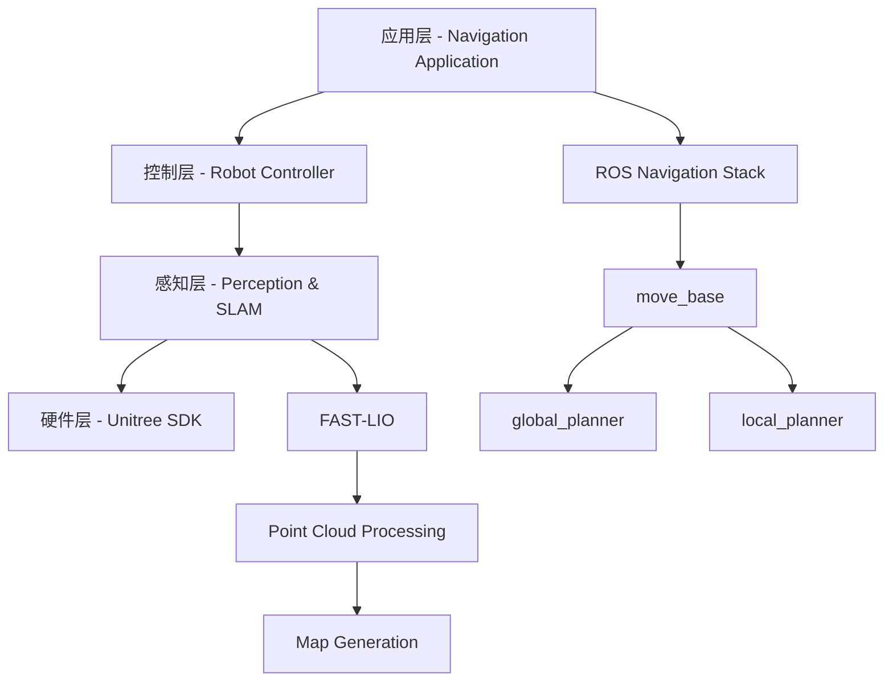
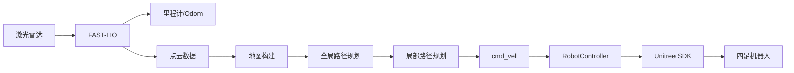
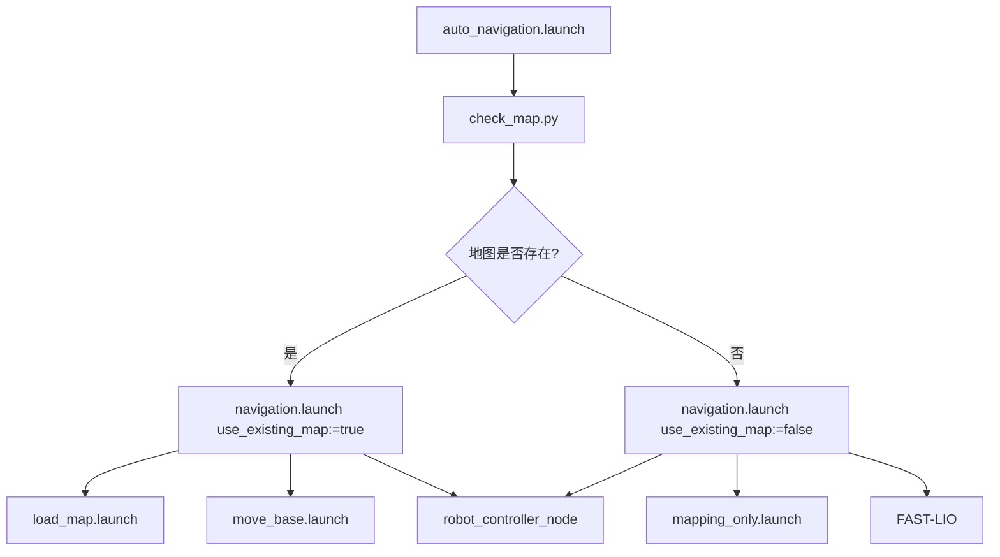
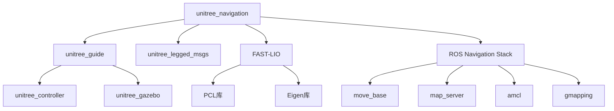
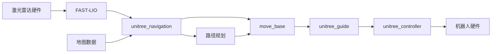

# Unitree_Navigation 模块详细分析报告

## 1. 项目概述

`unitree_navigation` 是一个**完整的四足机器人自主建图导航系统**，基于ROS开发，专为Unitree四足机器人设计。该系统集成了FAST-LIO激光雷达里程计和ROS导航栈，能够在未知环境中进行高精度建图和自主导航。

### 模块定位
- **架构层级**: 第6层 - 应用集成层
- **耦合度**: 🔴 **最高耦合** - 集成所有底层模块
- **重要性**: 🔴 **顶层应用系统**

## 2. 目录结构分析

```
unitree_navigation/
├── include/                    # 头文件目录
│   └── unitree_navigation/
│       └── robot_controller.h  # 机器人控制器头文件
├── src/                        # 源代码目录
│   └── control/               # 控制模块
│       ├── robot_controller.cpp    # 机器人控制器实现
│       └── robot_controller_node.cpp # 控制器节点
├── config/                     # 配置文件目录
│   ├── control.yaml           # 控制参数配置
│   ├── gmapping_params.yaml   # Gmapping建图参数
│   ├── costmap_common_params.yaml     # 代价地图通用参数
│   ├── global_costmap_params.yaml     # 全局代价地图参数
│   ├── local_costmap_params.yaml      # 局部代价地图参数
│   └── base_local_planner_params.yaml # 局部规划器参数
├── launch/                     # 启动文件目录
│   ├── navigation.launch      # 主导航启动文件
│   ├── mapping_only.launch    # 仅建图模式
│   ├── save_map.launch        # 保存地图
│   ├── auto_navigation.launch # 自动检测模式
│   └── load_map.launch        # 加载地图
├── scripts/                    # Python脚本目录
│   ├── map_saver_service.py   # 地图保存服务
│   └── check_map.py           # 地图检查脚本
├── maps/                       # 地图存储目录
├── package.xml.bak            # 包配置备份
├── CMakeLists.txt.bak         # 编译配置备份
├── .cursorrules               # 开发规范配置
└── README.md                  # 使用文档
```

## 3. 核心功能模块详细分析

### 3.1 系统架构设计

#### 四层架构模式


#### 数据流架构


### 3.2 控制模块 (Robot Controller)

**功能**: 将ROS导航命令转换为Unitree机器人可执行的高级控制命令

#### 核心类结构
```cpp
class RobotController {
private:
    // 机器人状态管理
    enum class RobotState {
        UNKNOWN,    // 未知状态
        STANDING,   // 站立状态
        SITTING,    // 坐下状态
        WALKING     // 行走状态
    };
    
    // Unitree SDK通信
    std::unique_ptr<UNITREE_LEGGED_SDK::UDP> udp_;
    UNITREE_LEGGED_SDK::HighCmd high_cmd_;
    UNITREE_LEGGED_SDK::HighState high_state_;
    
    // ROS接口
    ros::Subscriber cmd_vel_sub_;       // 速度命令订阅
    ros::Publisher odom_pub_;           // 里程计发布
    ros::ServiceServer stand_service_;  // 站立服务
    ros::ServiceServer sit_service_;    // 坐下服务
};
```

#### 关键功能实现
1. **速度命令转换**
   ```cpp
   void cmdVelCallback(const geometry_msgs::Twist::ConstPtr& msg) {
       // 将ROS cmd_vel转换为Unitree高级命令
       high_cmd_.velocity[0] = msg->linear.x;  // 前进速度
       high_cmd_.velocity[1] = msg->linear.y;  // 侧向速度
       high_cmd_.yawSpeed = msg->angular.z;    // 转向速度
   }
   ```

2. **多线程通信架构**
   - **控制线程**: 500Hz高频控制循环
   - **发送线程**: UDP数据发送
   - **接收线程**: UDP数据接收

3. **安全机制**
   - 速度限制: 可配置的最大线速度和角速度
   - 超时保护: 命令超时自动停止
   - 状态监控: 实时监控机器人状态

### 3.3 感知模块 (Perception & SLAM)

**功能**: 基于FAST-LIO进行激光雷达里程计和环境感知

#### FAST-LIO集成
- **位置**: `/home/moyuan/catkin_ws/src/gem-fast_lio/FAST_LIO`
- **功能**: 
  - 实时激光雷达里程计
  - 高精度定位 (误差<5cm)
  - 点云数据处理
  - 3D环境重建

#### 数据处理流程
```cpp
激光雷达原始数据 → FAST-LIO处理 → {
    里程计数据 (/odom)
    处理后点云 (/processed_cloud)
    TF变换 (map→odom→base_link)
}
```

### 3.4 建图模块 (Mapping)

**功能**: 支持多种SLAM算法进行环境地图构建

#### 支持的建图算法
1. **Gmapping**: 基于粒子滤波的2D SLAM
   ```yaml
   # gmapping_params.yaml 关键参数
   particles: 30              # 粒子数量
   delta: 0.05               # 地图分辨率
   maxUrange: 16.0           # 激光最大范围
   linearUpdate: 0.5         # 线性更新阈值
   angularUpdate: 0.5        # 角度更新阈值
   ```

2. **FAST-LIO建图**: 基于激光雷达里程计的3D SLAM
3. **混合建图**: 结合2D和3D信息的建图方式

#### 地图管理功能
- **自动保存**: 建图完成后自动保存地图
- **地图检测**: 自动检测已有地图文件
- **格式支持**: 支持`.yaml`和`.pgm`格式
- **存储位置**: `~/maps/` 目录

### 3.5 路径规划模块 (Path Planning)

**功能**: 基于ROS导航栈实现全局和局部路径规划

#### 全局路径规划
- **算法**: A*、Dijkstra等
- **代价地图**: 基于激光雷达数据构建
- **路径优化**: 平滑和优化路径

#### 局部路径规划
- **算法**: DWA (Dynamic Window Approach)
- **实时避障**: 基于局部传感器数据
- **动态重规划**: 环境变化时重新规划

#### 参数配置
```yaml
# base_local_planner_params.yaml
TrajectoryPlannerROS:
  max_vel_x: 0.5              # 最大线速度
  max_vel_theta: 0.5          # 最大角速度
  min_vel_x: 0.1              # 最小线速度
  escape_vel: -0.1            # 后退速度
  acc_lim_x: 0.5              # 线加速度限制
  acc_lim_theta: 1.0          # 角加速度限制
```

### 3.6 导航模块 (Navigation)

**功能**: 集成感知、定位、建图和路径规划功能

#### 工作模式
1. **遥控建图模式**
   - 手动控制机器人移动
   - 实时构建环境地图
   - 适用于初次探索环境

2. **自主导航模式**
   - 基于已知地图导航
   - 自动路径规划
   - 实时避障

3. **自动检测模式**
   - 智能检测地图存在性
   - 自动选择工作模式
   - 无缝切换功能

4. **路径记录与回放**
   - 记录机器人轨迹
   - 路径回放功能
   - 巡逻任务支持

## 4. 启动文件分析

### 4.1 主要启动文件

#### navigation.launch (主导航文件)
```xml
<launch>
    <arg name="map_name" default="my_map"/>
    <arg name="robot_ip" default="192.168.123.220"/>
    <arg name="use_existing_map" default="false"/>
    
    <!-- 根据参数选择建图或导航模式 -->
    <group if="$(arg use_existing_map)">
        <!-- 导航模式: 加载已有地图 -->
        <include file="$(find unitree_navigation)/launch/load_map.launch">
            <arg name="map_name" value="$(arg map_name)"/>
        </include>
        <include file="$(find move_base)/launch/move_base.launch"/>
    </group>
    
    <group unless="$(arg use_existing_map)">
        <!-- 建图模式: 启动SLAM -->
        <include file="$(find unitree_navigation)/launch/mapping_only.launch"/>
    </group>
    
    <!-- 启动机器人控制器 -->
    <node pkg="unitree_navigation" type="robot_controller_node" name="robot_controller"/>
</launch>
```

#### auto_navigation.launch (智能模式)
```xml
<launch>
    <arg name="map_name" default="my_map"/>
    <arg name="robot_ip" default="192.168.123.220"/>
    
    <!-- 运行地图检查脚本 -->
    <node pkg="unitree_navigation" type="check_map.py" name="map_checker" output="screen">
        <param name="map_name" value="$(arg map_name)"/>
        <param name="robot_ip" value="$(arg robot_ip)"/>
    </node>
</launch>
```

### 4.2 启动文件依赖关系



## 5. 配置参数分析

### 5.1 控制参数 (control.yaml)
```yaml
control_frequency: 500.0      # 控制频率 (Hz)
max_linear_speed: 0.5        # 最大线速度 (m/s)
max_angular_speed: 0.5       # 最大角速度 (rad/s)
robot_ip: 192.168.123.220    # 机器人IP地址
```

### 5.2 建图参数 (gmapping_params.yaml)
```yaml
# 坐标系设置
base_frame: base_link        # 机器人基坐标系
odom_frame: odom            # 里程计坐标系
map_frame: map              # 地图坐标系

# 地图参数
delta: 0.05                 # 地图分辨率 (m/pixel)
xmin: -50.0                 # 地图X轴最小值
xmax: 50.0                  # 地图X轴最大值
ymin: -50.0                 # 地图Y轴最小值
ymax: 50.0                  # 地图Y轴最大值

# SLAM参数
particles: 30               # 粒子滤波粒子数
maxUrange: 16.0            # 激光最大有效距离
linearUpdate: 0.5          # 线性移动更新阈值
angularUpdate: 0.5         # 角度变化更新阈值
```

### 5.3 导航参数配置

#### 代价地图参数
```yaml
# costmap_common_params.yaml
robot_radius: 0.5           # 机器人半径
inflation_radius: 1.0       # 膨胀半径
cost_scaling_factor: 10.0   # 代价缩放因子
```

## 6. 服务和话题接口

### 6.1 主要话题

#### 输入话题
```cpp
/cmd_vel                    // geometry_msgs/Twist - 速度控制命令
/move_base_simple/goal      // geometry_msgs/PoseStamped - 导航目标点
```

#### 输出话题
```cpp
/odom                       // nav_msgs/Odometry - 里程计数据
/processed_cloud           // sensor_msgs/PointCloud2 - 处理后点云
/map                       // nav_msgs/OccupancyGrid - 地图数据
```

#### 内部话题
```cpp
/move_base/goal            // move_base_msgs/MoveBaseActionGoal
/move_base/result          // move_base_msgs/MoveBaseActionResult
/move_base/feedback        // move_base_msgs/MoveBaseActionFeedback
```

### 6.2 主要服务

#### 机器人控制服务
```cpp
/robot_stand               // std_srvs/Trigger - 机器人站立
/robot_sit                 // std_srvs/Trigger - 机器人坐下
```

#### 路径记录服务
```cpp
/start_recording           // std_srvs/Trigger - 开始记录路径
/stop_recording            // std_srvs/Trigger - 停止记录路径
/save_path                 // std_srvs/Trigger - 保存路径
/clear_path                // std_srvs/Trigger - 清除路径
```

#### 地图管理服务
```cpp
/save_map                  // std_srvs/Trigger - 保存当前地图
```

## 7. 依赖关系分析

### 7.1 核心依赖模块

#### 🔴 强依赖模块

**1. unitree_legged_msgs (消息基础)**
```xml
<depend>unitree_legged_msgs</depend>
```
- **依赖原因**: 需要使用Unitree机器人的高级命令消息
- **具体使用**: `HighCmd`, `HighState`等消息类型

**2. unitree_guide (底层控制)**
- **依赖关系**: unitree_navigation作为高层应用，依赖unitree_guide提供的底层控制
- **交互方式**: 通过cmd_vel话题发送速度命令

**3. FAST-LIO (定位建图)**
- **依赖路径**: `/home/moyuan/catkin_ws/src/gem-fast_lio/FAST_LIO`
- **功能**: 提供高精度激光雷达里程计和建图功能

#### 🟡 中等依赖模块

**4. ROS导航栈**
```xml
<exec_depend>move_base</exec_depend>
<exec_depend>map_server</exec_depend>
<exec_depend>amcl</exec_depend>
<exec_depend>gmapping</exec_depend>
```

**5. 点云处理库**
```xml
<depend>pcl_ros</depend>
<depend>pcl_conversions</depend>
```

### 7.2 编译依赖

#### CMake依赖
```cmake
find_package(catkin REQUIRED COMPONENTS
  roscpp
  rospy
  std_msgs
  geometry_msgs
  nav_msgs
  sensor_msgs
  tf2
  tf2_ros
  move_base_msgs
  actionlib
  unitree_legged_msgs      # 🔴 强依赖
  laser_geometry
  tf2_sensor_msgs
  pcl_ros
  pcl_conversions
)
```

#### 系统依赖
```bash
# 操作系统要求
Ubuntu 18.04/20.04

# ROS版本
ROS Melodic/Noetic

# 硬件要求
CPU: Intel i7或同等性能
RAM: 8GB以上
存储: 50GB以上可用空间
```

## 8. 模块耦合关系图

### 8.1 系统级耦合关系



### 8.2 数据流耦合



## 9. 使用流程和模式

### 9.1 完整使用流程

#### 初次部署流程
```bash
# 1. 启动建图模式
roslaunch unitree_navigation mapping_only.launch

# 2. 手动控制建图 (遥控器或键盘)
# 移动机器人覆盖整个环境

# 3. 保存地图
roslaunch unitree_navigation save_map.launch map_name:=office_map

# 4. 后续导航使用
roslaunch unitree_navigation navigation.launch use_existing_map:=true map_name:=office_map
```

#### 日常使用流程
```bash
# 智能模式 - 自动检测并选择合适模式
roslaunch unitree_navigation auto_navigation.launch map_name:=office_map
```

### 9.2 典型应用场景

#### 场景1: 办公室巡逻
```bash
# 1. 建立办公室地图
roslaunch unitree_navigation mapping_only.launch

# 2. 设置巡逻路径
rosservice call /start_recording
# 手动引导机器人走一遍巡逻路线
rosservice call /stop_recording
rosservice call /save_path

# 3. 自动巡逻
roslaunch unitree_navigation navigation.launch use_existing_map:=true map_name:=office
```

#### 场景2: 仓库货物搬运
```bash
# 1. 建立仓库地图
roslaunch unitree_navigation mapping_only.launch

# 2. 定点导航
roslaunch unitree_navigation navigation.launch use_existing_map:=true map_name:=warehouse
# 通过rviz发送目标点
```

## 10. 性能指标和限制

### 10.1 性能指标

#### 建图性能
- **定位精度**: <5cm
- **地图分辨率**: 5cm/pixel
- **建图速度**: 实时 (与移动速度同步)
- **地图范围**: 100m × 100m

#### 导航性能
- **路径规划时间**: <100ms
- **避障反应时间**: <50ms
- **导航精度**: 目标点误差<10cm
- **最大速度**: 0.5m/s (可配置)

#### 系统性能
- **CPU使用率**: <70%
- **内存使用**: <4GB
- **连续运行时间**: >4小时
- **碰撞率**: <1%

### 10.2 当前限制

#### 技术限制
- ⚠️ **环境要求**: 需要结构化环境，对玻璃等透明物体检测困难
- ⚠️ **光照敏感**: 激光雷达不受光照影响，但视觉部分可能受影响
- ⚠️ **地形适应**: 主要适用于平坦地面，复杂地形需要调整

#### 硬件限制
- ⚠️ **激光雷达依赖**: 强依赖激光雷达数据质量
- ⚠️ **网络延迟**: UDP通信可能存在网络延迟
- ⚠️ **电池续航**: 受机器人硬件电池限制

## 11. 开发和扩展指南

### 11.1 添加新传感器

#### 步骤1: 传感器驱动集成
```cpp
// 在robot_controller.h中添加新传感器支持
class RobotController {
private:
    ros::Subscriber camera_sub_;    // 相机数据订阅
    ros::Subscriber lidar_sub_;     // 额外激光雷达订阅
    
    void cameraCallback(const sensor_msgs::Image::ConstPtr& msg);
    void lidarCallback(const sensor_msgs::LaserScan::ConstPtr& msg);
};
```

#### 步骤2: 数据融合
```cpp
// 实现多传感器数据融合
void RobotController::sensorFusion() {
    // 融合激光雷达、相机、IMU数据
    // 提高定位和建图精度
}
```

### 11.2 添加新的规划算法

#### 步骤1: 创建规划器类
```cpp
class CustomPlanner : public nav_core::BaseGlobalPlanner {
public:
    bool makePlan(const geometry_msgs::PoseStamped& start,
                  const geometry_msgs::PoseStamped& goal,
                  std::vector<geometry_msgs::PoseStamped>& plan) override;
};
```

#### 步骤2: 注册规划器
```xml
<!-- 在导航配置中注册新规划器 -->
<param name="base_global_planner" value="custom_planner/CustomPlanner"/>
```

### 11.3 性能优化建议

#### 计算优化
```cpp
// 使用多线程提高性能
std::thread planning_thread(&RobotController::pathPlanning, this);
std::thread perception_thread(&RobotController::perceptionProcessing, this);
```

#### 内存优化
```cpp
// 使用智能指针管理内存
std::shared_ptr<PointCloud> cloud_ptr = std::make_shared<PointCloud>();
```

## 12. 故障排除和调试

### 12.1 常见问题及解决方案

#### 问题1: 机器人无法连接
```bash
# 检查网络连接
ping 192.168.123.220

# 检查端口占用
netstat -an | grep 8090

# 解决方案
sudo ufw allow 8090
```

#### 问题2: 建图质量差
```yaml
# 调整FAST-LIO参数
scan_rate: 10               # 降低扫描频率
max_iteration: 4            # 增加迭代次数
```

#### 问题3: 导航精度低
```yaml
# 调整局部规划器参数
xy_goal_tolerance: 0.05     # 减小目标容忍度
yaw_goal_tolerance: 0.05    # 减小角度容忍度
```

### 12.2 调试工具

#### ROS调试命令
```bash
# 查看话题列表
rostopic list

# 监控数据流
rostopic echo /cmd_vel
rostopic echo /odom

# 检查TF树
rosrun tf view_frames
```

#### 可视化调试
```bash
# 启动RViz进行可视化调试
rosrun rviz rviz -d navigation.rviz
```

## 13. 总结

`unitree_navigation` 是一个设计完整的四足机器人导航系统，具有以下核心价值：

### 13.1 技术优势
1. **完整的解决方案**: 从感知到控制的端到端系统
2. **高精度定位**: 基于FAST-LIO的厘米级定位精度  
3. **智能模式切换**: 自动检测环境并选择合适的工作模式
4. **模块化设计**: 便于扩展和定制化开发
5. **实时性能**: 满足机器人实时控制要求

### 13.2 应用价值
1. **工业应用**: 适用于仓库、工厂等结构化环境
2. **服务应用**: 办公室巡逻、安防监控等场景
3. **研究平台**: 为四足机器人研究提供基础平台
4. **教育价值**: 为机器人导航算法学习提供完整案例

### 13.3 发展潜力
该系统为四足机器人在复杂环境中的自主导航提供了坚实的技术基础，随着算法优化和硬件升级，具有巨大的商业化和产业化潜力。