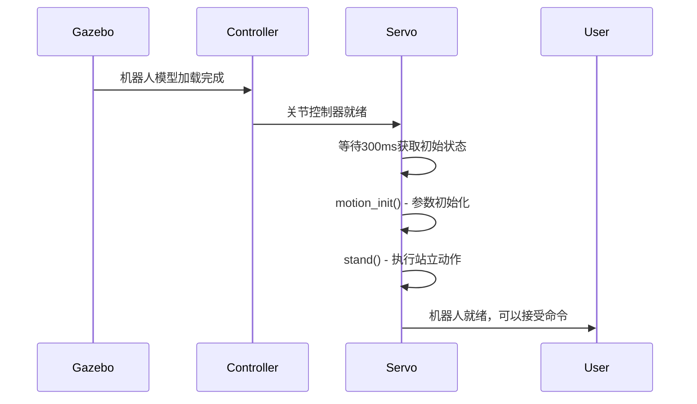

# unitree_controller 模块详细分析

## 模块概述

`unitree_controller` 是Unitree四足机器人项目的核心控制模块，负责在Gazebo仿真环境中实现机器人的运动控制、姿态管理和基本行为。它作为仿真环境和上层应用之间的桥梁，提供了多种控制模式和测试工具。

## 模块基本信息

### 位置与结构
```
unitree_controller/
├── CMakeLists.txt              # 构建配置
├── package.xml                 # 包依赖声明
├── include/
│   └── body.h                  # 机器人本体控制头文件
├── src/
│   ├── body.cpp                # 机器人本体控制实现
│   ├── servo.cpp               # 伺服控制主程序
│   ├── external_force.cpp      # 外力扰动测试工具
│   └── move_publisher.cpp      # 位置发布器（SLAM/视觉开发用）
└── launch/
    └── set_ctrl.launch         # 控制器参数设置
```

### 依赖关系分析
```cmake
find_package(catkin REQUIRED COMPONENTS
    controller_manager      # ROS控制器管理
    genmsg                 # 消息生成
    joint_state_controller # 关节状态控制器
    robot_state_publisher  # 机器人状态发布器
    roscpp                 # ROS C++接口
    gazebo_ros            # Gazebo ROS集成
    std_msgs              # ROS标准消息
    tf                    # 坐标变换
    geometry_msgs         # 几何消息
    unitree_legged_msgs   # 🔴 核心依赖：Unitree消息定义
)
```

**依赖级别**: 🔴 **第3层 - 中层控制层** - 依赖底层消息和ROS控制框架

## 构建目标分析

### 1. 核心库 (`unitree_controller`)
```cmake
add_library(${PROJECT_NAME}
    src/body.cpp 
)
```
- **功能**: 提供机器人本体控制的基础功能
- **用途**: 被其他可执行文件链接使用

### 2. 可执行文件

#### `unitree_servo` - 主控制器
```cmake
add_executable(unitree_servo src/servo.cpp)
target_link_libraries(unitree_servo ${PROJECT_NAME} ${catkin_LIBRARIES})
```
- **功能**: 主要的机器人伺服控制程序
- **用途**: 实现机器人站立、运动控制等基本功能

#### `unitree_external_force` - 扰动测试
```cmake
add_executable(unitree_external_force src/external_force.cpp)
target_link_libraries(unitree_external_force ${catkin_LIBRARIES})
```
- **功能**: 键盘控制的外力扰动测试工具
- **用途**: 测试机器人抗扰动能力和平衡控制

#### `unitree_move_kinetic` - 位置控制
```cmake
add_executable(unitree_move_kinetic src/move_publisher.cpp)
target_link_libraries(unitree_move_kinetic ${catkin_LIBRARIES})
```
- **功能**: 运动学位置控制器
- **用途**: SLAM和视觉开发中的位置控制

## 核心功能模块详细分析

### 1. body.h/body.cpp - 机器人本体控制

#### 核心数据结构
```cpp
namespace unitree_model {
    extern ros::Publisher servo_pub[12];     // 12个关节发布器
    extern ros::Publisher highState_pub;     // 高层状态发布器
    extern unitree_legged_msgs::LowCmd lowCmd;    // 底层控制命令
    extern unitree_legged_msgs::LowState lowState; // 底层状态反馈
}
```

#### 主要功能函数

##### `paramInit()` - 参数初始化
```cpp
void paramInit() {
    for (int i = 0; i < 4; i++) {
        // Hip关节 (每条腿的髋关节)
        lowCmd.motorCmd[i * 3 + 0].mode = 0x0A;  // 闭环控制模式
        lowCmd.motorCmd[i * 3 + 0].Kp = 70;      // 位置增益
        lowCmd.motorCmd[i * 3 + 0].Kd = 3;       // 速度增益
        
        // Thigh关节 (大腿关节)
        lowCmd.motorCmd[i * 3 + 1].mode = 0x0A;
        lowCmd.motorCmd[i * 3 + 1].Kp = 180;     // 更高的位置增益
        lowCmd.motorCmd[i * 3 + 1].Kd = 8;
        
        // Calf关节 (小腿关节)
        lowCmd.motorCmd[i * 3 + 2].mode = 0x0A;
        lowCmd.motorCmd[i * 3 + 2].Kp = 300;     // 最高的位置增益
        lowCmd.motorCmd[i * 3 + 2].Kd = 15;
    }
}
```

**PD控制参数设计理念**:
- **Hip (髋关节)**: Kp=70, Kd=3 - 相对较低的增益，保证稳定性
- **Thigh (大腿)**: Kp=180, Kd=8 - 中等增益，承载主要的身体重量
- **Calf (小腿)**: Kp=300, Kd=15 - 最高增益，需要精确控制足端位置

##### `stand()` - 站立控制
```cpp
void stand() {
    double pos[12] = {
        0.0, 0.67, -1.3,    // FR腿 (前右)
        -0.0, 0.67, -1.3,   // FL腿 (前左)  
        0.0, 0.67, -1.3,    // RR腿 (后右)
        -0.0, 0.67, -1.3    // RL腿 (后左)
    };
    moveAllPosition(pos, 2 * 1000);
}
```

**站立姿态解析**:
- **髋关节**: 0.0 rad (基本为0，保持身体对称)
- **大腿关节**: 0.67 rad (约38.4°，抬起大腿)
- **小腿关节**: -1.3 rad (约-74.5°，向后弯曲小腿)
- **执行时间**: 2000ms (2秒平滑过渡)

##### `moveAllPosition()` - 平滑运动控制
```cpp
void moveAllPosition(double *targetPos, double duration) {
    double pos[12], lastPos[12], percent;
    // 记录初始位置
    for (int j = 0; j < 12; j++)
        lastPos[j] = lowState.motorState[j].q;
    
    // 线性插值运动
    for (int i = 1; i <= duration; i++) {
        percent = (double)i / duration;
        for (int j = 0; j < 12; j++) {
            lowCmd.motorCmd[j].q = lastPos[j] * (1 - percent) + targetPos[j] * percent;
        }
        sendServoCmd();
    }
}
```

**平滑运动特性**:
- **线性插值**: 保证运动的平滑性，避免突变
- **实时控制**: 每1ms发送一次控制命令
- **安全检查**: 包含`ros::ok()`检查，支持中途停止

### 2. servo.cpp - 主控制程序

#### 系统架构
```cpp
class multiThread {
private:
    ros::NodeHandle nm;
    ros::Subscriber servo_sub[12];      // 12个关节状态订阅器
    ros::Subscriber imu_sub;            // IMU订阅器
    ros::Subscriber footForce_sub[4];   // 4个足端力订阅器
    string robot_name;                  // 机器人名称参数
};
```

#### 关节映射关系
```cpp
// 关节索引映射 (0-11)
servo_sub[0-2]:  FR_hip, FR_thigh, FR_calf    // 前右腿
servo_sub[3-5]:  FL_hip, FL_thigh, FL_calf    // 前左腿  
servo_sub[6-8]:  RR_hip, RR_thigh, RR_calf    // 后右腿
servo_sub[9-11]: RL_hip, RL_thigh, RL_calf    // 后左腿
```

#### 话题命名规范
```cpp
// 状态订阅话题
"/{robot_name}_gazebo/FR_hip_controller/state"
"/{robot_name}_gazebo/FR_thigh_controller/state"
"/{robot_name}_gazebo/FR_calf_controller/state"
// ... (其他11个关节)

// 控制发布话题  
"/{robot_name}_gazebo/FR_hip_controller/command"
"/{robot_name}_gazebo/FR_thigh_controller/command"
"/{robot_name}_gazebo/FR_calf_controller/command"
// ... (其他11个关节)
```

#### 传感器数据处理

##### IMU数据转换
```cpp
void imuCallback(const sensor_msgs::Imu &msg) {
    // 四元数姿态
    lowState.imu.quaternion[0] = msg.orientation.w;
    lowState.imu.quaternion[1] = msg.orientation.x;
    lowState.imu.quaternion[2] = msg.orientation.y;
    lowState.imu.quaternion[3] = msg.orientation.z;
    
    // 角速度
    lowState.imu.gyroscope[0] = msg.angular_velocity.x;
    lowState.imu.gyroscope[1] = msg.angular_velocity.y;
    lowState.imu.gyroscope[2] = msg.angular_velocity.z;
    
    // 线加速度
    lowState.imu.accelerometer[0] = msg.linear_acceleration.x;
    lowState.imu.accelerometer[1] = msg.linear_acceleration.y;
    lowState.imu.accelerometer[2] = msg.linear_acceleration.z;
}
```

##### 关节状态更新
```cpp
void FRhipCallback(const unitree_legged_msgs::MotorState &msg) {
    start_up = false;  // 标记系统已启动
    lowState.motorState[0].mode = msg.mode;
    lowState.motorState[0].q = msg.q;           // 位置
    lowState.motorState[0].dq = msg.dq;         // 速度
    lowState.motorState[0].tauEst = msg.tauEst; // 力矩估计
}
```

#### 主控制循环
```cpp
int main(int argc, char **argv) {
    // 初始化ROS和多线程订阅
    ros::AsyncSpinner spinner(1);
    spinner.start();
    usleep(300000);  // 等待300ms获取初始状态
    
    // 设置发布器
    ros::Publisher lowState_pub = n.advertise<unitree_legged_msgs::LowState>(
        "/" + robot_name + "_gazebo/lowState/state", 1);
    
    // 设置12个关节控制发布器
    for(int i = 0; i < 12; i++) {
        servo_pub[i] = n.advertise<unitree_legged_msgs::MotorCmd>(...);
    }
    
    motion_init();  // 初始化并站立
    
    // 主控制循环
    while (ros::ok()) {
        lowState_pub.publish(lowState);  // 发布状态
        sendServoCmd();                   // 发送控制命令
    }
}
```

### 3. external_force.cpp - 扰动测试工具

#### 键盘控制接口
```cpp
class teleForceCmd {
private:
    double Fx, Fy, Fz;                    // 三轴力
    ros::Publisher force_pub;              // 力发布器
    geometry_msgs::Wrench Force;          // 力消息
    
public:
    void keyLoop();                        // 键盘监听循环
    void pubForce(double x, double y, double z);  // 发布力
};
```

#### 控制模式
```cpp
int mode = 1;  // 1: 脉冲模式, -1: 连续模式
```

**脉冲模式** (mode > 0):
- 按键触发瞬时力
- 持续100ms后自动归零
- 适合模拟踢、推等瞬时扰动

**连续模式** (mode < 0):
- 按键施加持续力
- 需要手动调整或归零
- 适合模拟持续的外力

#### 键盘映射
```cpp
#define KEYCODE_UP    0x41    // 向前推力 (+Fx)
#define KEYCODE_DOWN  0x42    // 向后推力 (-Fx)  
#define KEYCODE_LEFT  0x44    // 向左推力 (+Fy)
#define KEYCODE_RIGHT 0x43    // 向右推力 (-Fy)
#define KEYCODE_SPACE 0x20    // 切换模式
```

#### 力控制逻辑
```cpp
case KEYCODE_UP:
    if(mode > 0) {
        Fx = 60;              // 脉冲模式：固定60N
    } else {
        Fx += 16;             // 连续模式：递增16N
        if(Fx > 220) Fx = 220;  // 限幅220N
        if(Fx < -220) Fx = -220;
    }
    break;
```

### 4. move_publisher.cpp - 位置控制器

#### 控制模式选择
```cpp
enum coord { WORLD, ROBOT };
coord def_frame = coord::WORLD;  // 默认世界坐标系
```

#### 世界坐标系模式
```cpp
if (def_frame == coord::WORLD) {
    // 圆周运动参数
    const double period = 5000;  // 周期5秒
    const double radius = 1.5;   // 半径1.5米
    
    // 计算圆周运动轨迹
    model_state_pub.pose.position.x = radius * sin(2 * M_PI * time_ms / period);
    model_state_pub.pose.position.y = radius * cos(2 * M_PI * time_ms / period);
    model_state_pub.pose.orientation = tf::createQuaternionMsgFromRollPitchYaw(
        0, 0, -2 * M_PI * time_ms / period);
    
    model_state_pub.reference_frame = "world";
}
```

**运动特性**:
- **轨迹**: 以原点为中心的圆周运动
- **半径**: 1.5米
- **周期**: 5秒一圈
- **方向**: 逆时针旋转
- **高度**: 固定0.5米

#### 机器人坐标系模式
```cpp
else if (def_frame == coord::ROBOT) {
    model_state_pub.twist.linear.x = 0.02;   // 前进 2cm/s
    model_state_pub.twist.linear.y = 0.0;    // 不侧移
    model_state_pub.twist.linear.z = 0.08;   // 上升 8cm/s
    
    model_state_pub.reference_frame = "base";
}
```

**运动特性**:
- **前进速度**: 2cm/s (相对机器人本体)
- **垂直速度**: 8cm/s (持续上升)
- **坐标系**: 机器人本体坐标系

## 使用方法与工作流程

### 1. 标准启动流程
```bash
# 1. 启动Gazebo仿真环境
roslaunch unitree_gazebo normal.launch rname:=go1 wname:=earth

# 2. 启动机器人控制器 (让机器人站立)
rosrun unitree_controller unitree_servo

# 3. (可选) 测试外力扰动
rosrun unitree_controller unitree_external_force

# 4. (可选) 测试位置控制 (SLAM/视觉开发)
rosrun unitree_controller unitree_move_kinetic
```

### 2. 系统启动时序


### 3. 实时控制循环


## 控制参数详细分析

### 1. PD控制器参数
| 关节类型 | Kp值 | Kd值 | 设计理念 |
|---------|------|------|----------|
| Hip (髋关节) | 70 | 3 | 低增益，保证系统稳定性 |
| Thigh (大腿) | 180 | 8 | 中增益，承载身体重量 |
| Calf (小腿) | 300 | 15 | 高增益，精确足端控制 |

### 2. 站立姿态角度
| 关节 | 角度(rad) | 角度(度) | 物理意义 |
|------|-----------|----------|----------|
| Hip | 0.0 | 0° | 髋关节基本对称 |
| Thigh | 0.67 | 38.4° | 大腿向前抬起 |
| Calf | -1.3 | -74.5° | 小腿向后弯曲 |

### 3. 扰动测试参数
| 模式 | 力大小 | 持续时间 | 应用场景 |
|------|--------|----------|----------|
| 脉冲模式 | 60N | 100ms | 模拟踢击、推撞 |
| 连续模式 | 8-220N | 持续 | 模拟持续外力 |

## 与其他模块的接口关系

### 1. 与 `unitree_legged_msgs` 的消息接口
```cpp
// 输入消息
unitree_legged_msgs::MotorState  // 从Gazebo接收关节状态
sensor_msgs::Imu                 // 从Gazebo接收IMU数据
geometry_msgs::WrenchStamped     // 从Gazebo接收足端力

// 输出消息  
unitree_legged_msgs::MotorCmd    // 发送给Gazebo的关节控制
unitree_legged_msgs::LowState    // 发布给上层应用的状态
```

### 2. 与 `unitree_gazebo` 的话题通信
```cpp
// 订阅话题 (从Gazebo获取状态)
"/{robot_name}_gazebo/FR_hip_controller/state"
"/trunk_imu"
"/visual/FR_foot_contact/the_force"

// 发布话题 (向Gazebo发送命令)
"/{robot_name}_gazebo/FR_hip_controller/command" 
"/gazebo/set_model_state"
"/apply_force/trunk"
```

### 3. 与上层导航系统的接口
```cpp
// 状态发布 (供导航系统使用)
"/{robot_name}_gazebo/lowState/state"
"/odom"  // 里程计信息 (通过其他模块)
```

## 设计模式与架构特点

### 1. 多线程异步设计
```cpp
ros::AsyncSpinner spinner(1);  // 单线程异步处理
spinner.start();               // 非阻塞消息处理
```
**优点**:
- 消息接收与控制逻辑分离
- 避免回调函数阻塞主循环
- 保证实时控制性能

### 2. 命名空间封装
```cpp
namespace unitree_model {
    // 全局变量和函数
}
```
**优点**:
- 避免全局命名冲突
- 代码组织清晰
- 便于模块化开发

### 3. 参数化机器人配置
```cpp
std::string robot_name;
ros::param::get("/robot_name", robot_name);  // 动态获取机器人名称
```
**优点**:
- 支持多种机器人型号 (Go1, A1, Laikago等)
- 运行时配置，无需重编译
- 便于多机器人仿真

## 性能特性与限制

### 1. 实时性能
- **控制频率**: 1000Hz (1ms控制周期)
- **启动延迟**: 300ms (等待初始状态)
- **站立时间**: 2000ms (平滑过渡)

### 2. 安全机制
```cpp
if (!ros::ok()) break;  // 检查ROS状态
```
- 支持优雅停止
- 异常情况自动退出
- 防止控制指令丢失

### 3. 系统限制
- 仅支持Gazebo仿真环境
- 不包含高级步态规划
- 需要手动调整PD参数

## 扩展与定制建议

### 1. 添加新的控制模式
```cpp
// 在body.cpp中添加新函数
void walkForward() {
    // 实现前进步态
}

void customGait(double params[]) {
    // 实现自定义步态
}
```

### 2. 增强传感器集成
```cpp
// 添加更多传感器回调
void lidarCallback(const sensor_msgs::LaserScan& msg);
void cameraCallback(const sensor_msgs::Image& msg);
```

### 3. 改进控制算法
```cpp
// 将PD控制升级为MPC或其他高级控制
void advancedController() {
    // 实现模型预测控制
    // 实现阻抗控制
    // 实现自适应控制
}
```

## 常见问题与调试

### 1. 机器人无法站立
**可能原因**:
- PD参数不当
- 初始位置不正确
- Gazebo物理参数问题

**解决方法**:
```cpp
// 调整PD参数
lowCmd.motorCmd[i].Kp = 100;  // 增加位置增益
lowCmd.motorCmd[i].Kd = 5;    // 增加阻尼

// 检查初始姿态
ROS_INFO("Current position: %f", lowState.motorState[i].q);
```

### 2. 控制响应滞后
**可能原因**:
- 控制频率过低
- 消息队列堵塞
- 计算负载过高

**解决方法**:
```cpp
// 增加发布器队列大小
servo_pub[i] = n.advertise<unitree_legged_msgs::MotorCmd>(topic, 10);

// 优化控制循环
ros::Rate loop_rate(1000);  // 确保1000Hz
```

### 3. 外力测试无效果
**可能原因**:
- 话题名称不匹配
- 力的大小不合适
- Gazebo插件未加载

**解决方法**:
```bash
# 检查话题连接
rostopic echo /apply_force/trunk

# 检查Gazebo插件
rosrun gazebo_ros spawn_model -help
```

## 总结

`unitree_controller` 模块是Unitree机器人仿真系统的核心控制组件，具有以下关键特性：

### 🔴 **核心功能**
1. **基础运动控制**: 实现机器人站立、关节控制等基本功能
2. **仿真环境桥接**: 连接Gazebo仿真与ROS控制系统
3. **开发工具集**: 提供扰动测试、位置控制等开发辅助工具
4. **多机器人支持**: 通过参数化配置支持不同型号机器人

### 🟡 **架构特点**
1. **模块化设计**: body控制库 + 多个专用可执行文件
2. **实时控制**: 1000Hz高频控制循环
3. **多线程处理**: 异步消息处理保证实时性
4. **安全机制**: 完善的错误检查和优雅停止

### 🟢 **在项目中的地位**
- **桥接作用**: 连接底层消息和上层应用
- **测试平台**: 为算法开发提供基础控制环境
- **参考实现**: 为真实机器人控制提供参考

该模块为整个Unitree机器人项目提供了稳定可靠的仿真控制基础，是进行算法开发和测试的重要平台。