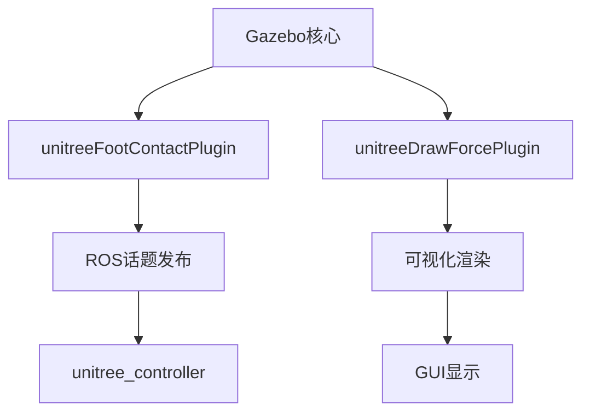

# unitree_gazebo 模块详细分析

## 模块概述

`unitree_gazebo` 是Unitree四足机器人项目的仿真环境核心模块，负责提供Gazebo仿真环境、自定义插件、仿真世界以及机器人模型的集成。它作为整个项目的"虚拟试验场"，为控制算法开发和测试提供了完整的物理仿真环境。

## 模块基本信息

### 位置与结构
```
unitree_gazebo/
├── CMakeLists.txt              # 构建配置
├── package.xml                 # 包依赖声明
├── launch/
│   └── normal.launch           # 标准仿真启动文件
├── worlds/                     # 仿真世界文件
│   ├── earth.world             # 地球环境(默认)
│   ├── space.world             # 太空环境
│   ├── stairs.world            # 楼梯环境
│   └── building_editor_models/ # 建筑编辑器模型
├── plugin/                     # 自定义Gazebo插件
│   ├── foot_contact_plugin.cc  # 足端接触检测插件
│   └── draw_force_plugin.cc    # 力可视化插件
└── urdf/                       # 机器人描述文件(如果有)
```

### 依赖关系分析
```cmake
find_package(catkin REQUIRED COMPONENTS
    controller_manager      # ROS控制器管理
    genmsg                 # 消息生成工具
    joint_state_controller # 关节状态控制器
    robot_state_publisher  # 机器人状态发布器
    roscpp                 # ROS C++接口
    gazebo_ros            # Gazebo ROS集成(核心依赖)
    std_msgs              # ROS标准消息
    tf                    # 坐标变换
    geometry_msgs         # 几何消息
    unitree_legged_msgs   # 🔴 核心依赖：Unitree消息定义
)

find_package(gazebo REQUIRED)  # 🔴 核心依赖：Gazebo仿真引擎
```

**依赖级别**: 🔴 **第3层 - 中层控制层** - 与unitree_controller并列，双向紧密耦合

## 核心功能模块

### 1. 构建目标分析

#### Gazebo插件构建
```cmake
# 足端接触检测插件
add_library(unitreeFootContactPlugin SHARED plugin/foot_contact_plugin.cc)
target_link_libraries(unitreeFootContactPlugin ${catkin_LIBRARIES} ${GAZEBO_LIBRARIES})

# 力可视化插件  
add_library(unitreeDrawForcePlugin SHARED plugin/draw_force_plugin.cc)
target_link_libraries(unitreeDrawForcePlugin ${catkin_LIBRARIES} ${GAZEBO_LIBRARIES})
```

**插件特性**:
- **共享库形式**: 动态加载到Gazebo环境
- **ROS集成**: 支持ROS话题通信
- **可视化支持**: 提供仿真数据的可视化

#### 插件路径配置
```xml
<export>
    <gazebo_ros plugin_path="${prefix}/lib" gazebo_media_path="${prefix}"/>
</export>
```

### 2. 启动文件架构 (`normal.launch`)

#### 参数化设计
```xml
<arg name="wname" default="earth"/>          <!-- 世界名称：earth/space/stairs -->
<arg name="rname" default="laikago"/>        <!-- 机器人名称：laikago/go1/a1/aliengo -->
<arg name="robot_path" value="(find $(arg rname)_description)"/>  <!-- 动态机器人路径 -->

<!-- Gazebo控制参数 -->
<arg name="paused" default="true"/>          <!-- 启动时暂停 -->
<arg name="use_sim_time" default="true"/>    <!-- 使用仿真时间 -->
<arg name="gui" default="true"/>             <!-- 显示GUI -->
<arg name="headless" default="false"/>       <!-- 无头模式 -->
<arg name="debug" default="false"/>          <!-- 调试模式 -->
<arg name="user_debug" default="false"/>     <!-- 用户调试模式 -->
```

**设计优势**:
- **多机器人支持**: 通过`rname`参数支持不同机器人型号
- **多环境支持**: 通过`wname`参数支持不同仿真场景
- **灵活配置**: 支持有GUI/无GUI、调试/正常等多种模式

#### 系统集成流程
```xml
<!-- 1. 启动Gazebo世界 -->
<include file="$(find gazebo_ros)/launch/empty_world.launch">
    <arg name="world_name" value="$(find unitree_gazebo)/worlds/$(arg wname).world"/>
    <!-- ... 其他参数 ... -->
</include>

<!-- 2. 加载机器人描述 -->
<param name="robot_description"
       command="$(find xacro)/xacro --inorder '$(arg dollar)$(arg robot_path)/xacro/robot.xacro' 
       DEBUG:=$(arg user_debug)"/>

<!-- 3. 生成机器人模型 -->
<node pkg="gazebo_ros" type="spawn_model" name="urdf_spawner" respawn="false" output="screen"
      args="-urdf -z 0.6 -model $(arg rname)_gazebo -param robot_description -unpause"/>

<!-- 4. 加载控制器配置 -->
<rosparam file="$(arg dollar)$(arg robot_path)/config/robot_control.yaml" command="load"/>

<!-- 5. 启动关节控制器 -->
<node pkg="controller_manager" type="spawner" name="controller_spawner" respawn="false"
      output="screen" ns="/$(arg rname)_gazebo" args="joint_state_controller
      FL_hip_controller FL_thigh_controller FL_calf_controller
      FR_hip_controller FR_thigh_controller FR_calf_controller
      RL_hip_controller RL_thigh_controller RL_calf_controller
      RR_hip_controller RR_thigh_controller RR_calf_controller "/>

<!-- 6. 启动状态发布器 -->
<node pkg="robot_state_publisher" type="robot_state_publisher" name="robot_state_publisher"
      respawn="false" output="screen">
    <remap from="/joint_states" to="/$(arg rname)_gazebo/joint_states"/>
</node>

<!-- 7. 集成unitree_controller -->
<include file="$(find unitree_controller)/launch/set_ctrl.launch">
    <arg name="rname" value="$(arg rname)"/>
</include>
```

### 3. 仿真世界环境

#### `earth.world` - 地球环境(默认)
**物理参数**:
```xml
<physics type="ode">
    <max_step_size>0.0002</max_step_size>        <!-- 高精度时间步长 -->
    <real_time_factor>1</real_time_factor>       <!-- 实时系数 -->
    <real_time_update_rate>5000</real_time_update_rate>  <!-- 5kHz更新率 -->
    <gravity>0 0 -9.81</gravity>                 <!-- 标准重力 -->
</physics>
```

**环境特色**:
- **基础平面**: 标准地面模型
- **静态障碍物**: 简单的立方体障碍物
- **光照系统**: 太阳光源和天空环境
- **适用场景**: 基础算法测试、常规导航验证

#### `stairs.world` - 楼梯环境
**物理参数**:
```xml
<physics type="ode">
    <max_step_size>0.001</max_step_size>         <!-- 标准精度 -->
    <real_time_update_rate>1000</real_time_update_rate>  <!-- 1kHz更新率 -->
</physics>
```

**环境特色**:
- **楼梯结构**: 多级台阶设计
- **复杂地形**: 测试机器人爬升能力
- **材质设置**: 木质纹理的台阶表面
- **适用场景**: 步态算法测试、地形适应性验证

#### `space.world` - 太空环境
**环境特色**:
- **低重力环境**: 适合测试特殊物理条件
- **无大气阻力**: 纯动力学测试
- **适用场景**: 极端环境算法测试

### 4. 自定义插件系统

#### `unitreeFootContactPlugin` - 足端接触检测
**功能特性**:
- **接触力检测**: 实时监测足端与地面接触力
- **多足支持**: 支持四个足端同时检测
- **力数据发布**: 通过ROS话题发布力传感器数据
- **仿真真实性**: 提供类似真实传感器的数据

**应用价值**:
- 步态规划验证
- 平衡控制测试
- 地形适应算法开发

#### `unitreeDrawForcePlugin` - 力可视化
**技术实现**:
```cpp
// 动态线条渲染
this->line = this->visual->CreateDynamicLine(rendering::RENDERING_LINE_STRIP);

// 颜色和材质设置
this->line->setMaterial("Gazebo/Purple");
this->line->setVisibilityFlags(GZ_VISIBILITY_GUI);
```

**功能特性**:
- **实时力可视化**: 在Gazebo中显示作用力向量
- **颜色编码**: 不同颜色表示不同力的大小
- **动态更新**: 实时跟随力的变化更新显示
- **ROS话题集成**: 订阅力数据话题

**应用价值**:
- 直观的力学分析
- 调试外力扰动效果
- 教学演示工具

## 与其他模块的接口关系

### 1. 与 `unitree_controller` 的双向耦合

#### 话题通信接口
```bash
# unitree_gazebo → unitree_controller (状态反馈)
"/{robot_name}_gazebo/FR_hip_controller/state"      # 关节状态
"/{robot_name}_gazebo/joint_states"                 # 整体关节状态
"/trunk_imu"                                        # IMU数据
"/visual/FR_foot_contact/the_force"                 # 足端力数据

# unitree_controller → unitree_gazebo (控制命令)
"/{robot_name}_gazebo/FR_hip_controller/command"    # 关节控制命令
"/gazebo/set_model_state"                           # 模型状态设置
"/apply_force/trunk"                                # 外力施加
```

#### 启动文件交叉引用
```xml
<!-- unitree_gazebo调用unitree_controller -->
<include file="$(find unitree_controller)/launch/set_ctrl.launch">
    <arg name="rname" value="$(arg rname)"/>
</include>
```

### 2. 与机器人描述包的依赖
- **动态引用**: `(find $(arg rname)_description)`
- **支持型号**: laikago, go1, a1, aliengo
- **URDF/Xacro集成**: 自动加载机器人模型

### 3. 与 `unitree_legged_msgs` 的消息依赖
```cpp
// 插件中使用的消息类型
#include "unitree_legged_msgs/MotorState.h"     // 电机状态
#include "unitree_legged_msgs/MotorCmd.h"       // 电机命令
#include <geometry_msgs/WrenchStamped.h>        // 力扭矩数据
```

## 系统架构特点

### 1. 模块化插件架构


### 2. 参数化环境配置
| 参数 | 选项 | 说明 |
|------|------|------|
| `wname` | earth/space/stairs | 仿真世界选择 |
| `rname` | laikago/go1/a1/aliengo | 机器人型号 |
| `gui` | true/false | 是否显示图形界面 |
| `paused` | true/false | 启动时是否暂停 |
| `debug` | true/false | 是否开启调试模式 |

### 3. 分层系统集成
```
应用层：unitree_navigation, unitree_guide
     ↓
控制层：unitree_controller ↔ unitree_gazebo
     ↓
基础层：unitree_legged_msgs, robot_description
```

## 性能与物理仿真特性

### 1. 物理引擎配置
```xml
<!-- 高性能设置 (earth.world) -->
<max_step_size>0.0002</max_step_size>              <!-- 0.2ms精度 -->
<real_time_update_rate>5000</real_time_update_rate> <!-- 5kHz更新 -->

<!-- 标准设置 (stairs.world) -->
<max_step_size>0.001</max_step_size>               <!-- 1ms精度 -->
<real_time_update_rate>1000</real_time_update_rate> <!-- 1kHz更新 -->
```

### 2. 多环境适配性
- **earth**: 标准测试环境，高更新频率
- **stairs**: 复杂地形环境，中等精度
- **space**: 特殊物理环境，低重力测试

### 3. 插件扩展能力
- **开放接口**: 支持自定义插件开发
- **ROS集成**: 插件可直接与ROS通信
- **可视化支持**: 支持自定义可视化元素

## 使用方法与应用场景

### 1. 标准仿真启动
```bash
# 基本启动
roslaunch unitree_gazebo normal.launch

# 指定机器人和环境
roslaunch unitree_gazebo normal.launch rname:=go1 wname:=stairs

# 无GUI模式
roslaunch unitree_gazebo normal.launch gui:=false

# 调试模式
roslaunch unitree_gazebo normal.launch debug:=true user_debug:=true
```

### 2. 与其他模块集成
```bash
# 完整仿真+控制系统
roslaunch unitree_gazebo normal.launch        # 终端1：启动仿真
rosrun unitree_controller unitree_servo       # 终端2：机器人控制
rosrun unitree_controller unitree_external_force  # 终端3：扰动测试
```

### 3. 应用场景分类

#### 算法开发阶段
- **earth环境**: 基础算法验证
- **高精度设置**: 确保仿真准确性
- **GUI开启**: 便于观察和调试

#### 性能测试阶段  
- **stairs环境**: 复杂地形测试
- **插件激活**: 获取详细传感器数据
- **力可视化**: 分析力学特性

#### 批量测试阶段
- **headless模式**: 无GUI运行
- **脚本化启动**: 自动化测试流程
- **数据记录**: 记录仿真结果

## 扩展性与定制化

### 1. 新环境开发
```xml
<!-- 创建新的.world文件 -->
<sdf version="1.5">
    <world name="custom_environment">
        <!-- 自定义物理参数 -->
        <!-- 自定义地形和障碍物 -->
        <!-- 自定义光照和材质 -->
    </world>
</sdf>
```

### 2. 插件开发接口
```cpp
// 自定义传感器插件模板
class CustomSensorPlugin : public gazebo::SensorPlugin {
public:
    void Load(sensors::SensorPtr _sensor, sdf::ElementPtr _sdf);
    void OnUpdate();
private:
    // ROS节点和发布器
    // 传感器数据处理逻辑
};
```

### 3. 机器人型号扩展
- 添加新的`robot_description`包
- 修改启动参数支持新型号
- 适配控制器配置文件

## 在项目中的核心作用

### 🎯 **仿真环境基础设施**
`unitree_gazebo` 为整个项目提供了：
- **标准化测试平台**: 统一的仿真环境
- **多场景支持**: 不同复杂度的测试环境
- **真实感仿真**: 高精度物理模拟

### 🔧 **开发支撑工具**
- **可视化调试**: 力可视化、状态监控
- **传感器仿真**: 足端力、IMU等传感器数据
- **扰动测试**: 外力施加和响应测试

### 📈 **项目集成中心**
- **控制器集成**: 与unitree_controller紧密协作
- **多机器人支持**: 统一的多型号机器人接口
- **上层应用支撑**: 为导航、规划提供仿真基础

## 总结

`unitree_gazebo` 模块作为整个Unitree机器人项目的"虚拟试验场"，具有以下关键特性：

### 🔴 **核心功能**
1. **高精度物理仿真**: 提供真实的机器人动力学环境
2. **多环境支持**: earth/stairs/space等不同测试场景
3. **自定义插件系统**: 足端接触检测、力可视化等专业工具
4. **多机器人兼容**: 支持laikago/go1/a1/aliengo等多种型号

### 🟡 **架构特点**
1. **参数化设计**: 灵活的环境和机器人配置
2. **模块化插件**: 可扩展的功能组件
3. **标准化接口**: 与ROS生态无缝集成
4. **分层集成**: 完整的系统启动和配置流程

### 🟢 **在项目中的地位**
- **仿真基础设施**: 为所有算法提供测试环境
- **开发效率工具**: 降低真实机器人测试成本
- **系统集成平台**: 连接各个功能模块的虚拟环境

该模块为整个Unitree机器人项目提供了完整、高质量的仿真环境，是算法开发、测试和验证的重要基础设施。