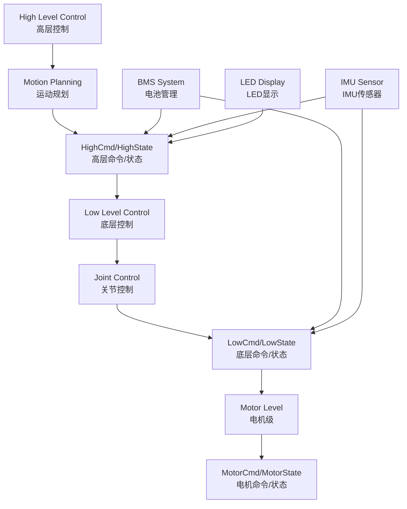

# unitree_legged_msgs 模块详细分析

## 模块概述

`unitree_legged_msgs` 是整个Unitree四足机器人项目的核心消息定义包，位于 `unitree_ros_to_real/unitree_legged_msgs/`。它定义了机器人与ROS系统之间通信的所有消息类型，是整个项目的通信基础。

## 模块基本信息

### 位置与结构
```
unitree_ros_to_real/unitree_legged_msgs/
├── CMakeLists.txt          # 构建配置
├── package.xml             # 包依赖声明
├── msg/                    # 消息定义文件夹
│   ├── MotorCmd.msg        # 电机控制命令
│   ├── MotorState.msg      # 电机状态
│   ├── LowCmd.msg          # 底层控制命令
│   ├── LowState.msg        # 底层状态
│   ├── HighCmd.msg         # 高层控制命令
│   ├── HighState.msg       # 高层状态
│   ├── BmsCmd.msg          # 电池管理命令
│   ├── BmsState.msg        # 电池管理状态
│   ├── IMU.msg             # 惯性测量单元
│   ├── LED.msg             # LED控制
│   └── Cartesian.msg       # 三维坐标
└── include/                # 转换函数头文件
```

### 依赖关系
```cmake
find_package(catkin REQUIRED COMPONENTS
  message_generation    # 消息生成工具
  std_msgs             # ROS标准消息
  geometry_msgs        # 几何消息
  sensor_msgs          # 传感器消息
)
```

**依赖级别**: 🟢 **最底层** - 仅依赖ROS标准消息包

## 消息类型详细分析

### 1. 电机控制层消息

#### `MotorCmd.msg` - 电机控制命令
```ros
uint8 mode           # 电机目标模式
float32 q            # 电机目标位置 (rad)
float32 dq           # 电机目标速度 (rad/s)
float32 tau          # 电机目标力矩 (N*m)
float32 Kp           # 电机位置刚度系数
float32 Kd           # 电机阻尼系数
uint32[3] reserve    # 保留字段
```

**应用场景**: 
- 关节级精确控制
- PD控制器参数设置
- 力矩直接控制

#### `MotorState.msg` - 电机状态反馈
```ros
uint8 mode           # 电机当前模式
float32 q            # 电机当前位置 (rad)
float32 dq           # 电机当前速度 (rad/s)
float32 ddq          # 电机当前加速度 (rad/s²)
float32 tauEst       # 当前估计输出力矩 (N*m)
float32 q_raw        # 电机原始位置
float32 dq_raw       # 电机原始速度
float32 ddq_raw      # 电机原始加速度
int8 temperature     # 电机温度（有延迟）
uint32[2] reserve    # 保留字段
```

**关键特性**:
- 提供原始和处理后的数据
- 包含温度监控
- 支持力矩估计

### 2. 底层控制消息

#### `LowCmd.msg` - 底层控制命令
```ros
uint8[2] head                # 消息头
uint8 levelFlag              # 控制级别标志
uint8 frameReserve           # 帧保留

uint32[2] SN                 # 序列号
uint32[2] version            # 版本信息
uint16 bandWidth             # 带宽设置

MotorCmd[20] motorCmd        # 20个电机控制命令
BmsCmd bms                   # 电池管理命令
uint8[40] wirelessRemote     # 无线遥控数据
uint32 reserve               # 保留
uint32 crc                   # 校验码
```

**重要特性**:
- **20个电机阵列**: 覆盖四足机器人所有关节
- **完整的通信协议**: 包含头部、版本、校验等
- **集成式设计**: 一条消息控制整个机器人

#### `LowState.msg` - 底层状态反馈
```ros
uint8[2] head                # 消息头
uint8 levelFlag              # 控制级别标志
uint8 frameReserve           # 帧保留

uint32[2] SN                 # 序列号
uint32[2] version            # 版本信息
uint16 bandWidth             # 带宽设置

IMU imu                      # 惯性测量单元数据
MotorState[20] motorState    # 20个电机状态
BmsState bms                 # 电池管理状态
int16[4] footForce           # 足端力传感器数据
int16[4] footForceEst        # 足端力估计
uint32 tick                  # 时间戳
uint8[40] wirelessRemote     # 无线遥控数据
uint32 reserve               # 保留
uint32 crc                   # 校验码

# 以下为旧版本兼容字段（Aliengo不包含）
Cartesian[4] eeForceRaw      # 末端执行器原始力
Cartesian[4] eeForce         # 末端执行器力（实际为1DOF，但用3DOF显示）
Cartesian position           # 位置（将删除）
Cartesian velocity           # 速度（将删除）
Cartesian velocity_w         # 角速度（将删除）
```

### 3. 高层控制消息

#### `HighCmd.msg` - 高层控制命令
```ros
uint8[2] head                # 消息头
uint8 levelFlag              # 控制级别标志
uint8 frameReserve           # 帧保留

uint32[2] SN                 # 序列号
uint32[2] version            # 版本信息
uint16 bandWidth             # 带宽设置

uint8 mode                   # 控制模式
uint8 gaitType               # 步态类型
uint8 speedLevel             # 速度级别
float32 footRaiseHeight      # 足部抬起高度
float32 bodyHeight           # 身体高度
float32[2] position          # 位置 [x, y]
float32[3] euler             # 欧拉角 [roll, pitch, yaw]
float32[2] velocity          # 速度 [vx, vy]
float32 yawSpeed             # 偏航角速度
float32[2] dComXy            # 质心偏移
float32[2] dstandFootXy      # 站立足位偏移

BmsCmd bms                   # 电池管理命令
LED[4] led                   # LED控制（4个LED）
uint8[40] wirelessRemote     # 无线遥控数据
uint32 reserve               # 保留
uint32 crc                   # 校验码
```

**高层控制特点**:
- **步态控制**: 支持多种步态模式
- **身体姿态**: 直接控制身体高度和姿态
- **运动参数**: 速度、方向、偏航控制
- **可视化**: 集成LED状态指示

#### `HighState.msg` - 高层状态反馈
```ros
uint8[2] head                # 消息头
uint8 levelFlag              # 控制级别标志
uint8 frameReserve           # 帧保留

uint32[2] SN                 # 序列号
uint32[2] version            # 版本信息  
uint16 bandWidth             # 带宽设置

IMU imu                      # 惯性测量单元
MotorState[20] motorState    # 20个电机状态
BmsState bms                 # 电池管理状态
int16[4] footForce           # 足端力
int16[4] footForceEst        # 足端力估计

uint8 mode                   # 当前模式
float32 progress             # 执行进度
uint8 gaitType               # 当前步态类型
float32 footRaiseHeight      # 当前足部抬起高度
float32[3] position          # 当前位置 [x, y, z]
float32 bodyHeight           # 当前身体高度
float32[3] velocity          # 当前速度 [vx, vy, vz]
float32 yawSpeed             # 当前偏航角速度
float32[4] rangeObstacle     # 距离障碍物范围
Cartesian[4] footPosition2Body   # 足部相对身体位置
Cartesian[4] footSpeed2Body      # 足部相对身体速度

uint8[40] wirelessRemote     # 无线遥控数据
uint32 reserve               # 保留
uint32 crc                   # 校验码
```

### 4. 辅助消息类型

#### `IMU.msg` - 惯性测量单元
```ros
float32[4] quaternion        # 四元数姿态
float32[3] gyroscope         # 陀螺仪数据 (rad/s)
float32[3] accelerometer     # 加速度计数据 (m/s²)
float32[3] rpy               # 欧拉角 [roll, pitch, yaw]
int8 temperature             # 温度
```

#### `BmsCmd.msg` / `BmsState.msg` - 电池管理
```ros
# BmsCmd.msg
uint8 off                    # 关闭命令
uint8[3] reserve             # 保留

# BmsState.msg  
uint8 version_h              # 版本高位
uint8 version_l              # 版本低位
uint8 bms_status             # BMS状态
uint8 SOC                    # 电量百分比 (0-100%)
int32 current                # 电流 (mA)
uint16 cycle                 # 循环次数
int8[8] BQ_NTC               # BQ芯片温度 (°C)
int8[8] MCU_NTC              # MCU温度 (°C)  
uint16[30] cell_vol          # 电池单体电压 (mV)
```

#### `LED.msg` - LED控制
```ros
uint8 r                      # 红色分量 (0-255)
uint8 g                      # 绿色分量 (0-255)
uint8 b                      # 蓝色分量 (0-255)
```

#### `Cartesian.msg` - 三维坐标
```ros
float32 x                    # X坐标
float32 y                    # Y坐标  
float32 z                    # Z坐标
```

## 消息转换机制

### ROS ↔ Unitree SDK 转换
项目提供了完整的消息转换功能，位于 `unitree_legged_real/include/convert.h`:

```cpp
// ROS消息转换为Unitree SDK命令
UNITREE_LEGGED_SDK::MotorCmd rosMsg2Cmd(const unitree_legged_msgs::MotorCmd &msg);
UNITREE_LEGGED_SDK::LowCmd rosMsg2Cmd(const unitree_legged_msgs::LowCmd &msg);
UNITREE_LEGGED_SDK::HighCmd rosMsg2Cmd(const unitree_legged_msgs::HighCmd &msg);

// Unitree SDK状态转换为ROS消息
unitree_legged_msgs::MotorState state2rosMsg(UNITREE_LEGGED_SDK::MotorState &state);
unitree_legged_msgs::LowState state2rosMsg(UNITREE_LEGGED_SDK::LowState &state);
unitree_legged_msgs::HighState state2rosMsg(UNITREE_LEGGED_SDK::HighState &state);
```

## 控制层次架构

### 三层控制结构



### 控制级别说明

1. **高层控制 (High Level)**
   - **用途**: 整体运动控制和步态规划
   - **特点**: 抽象度高，用户友好
   - **适用**: 导航、遥控操作

2. **底层控制 (Low Level)**  
   - **用途**: 关节级精确控制
   - **特点**: 直接控制20个电机
   - **适用**: 高精度运动、平衡控制

3. **电机级控制 (Motor Level)**
   - **用途**: 单个电机的PD控制
   - **特点**: 最底层的硬件接口
   - **适用**: 电机测试、故障诊断

## 数据流向分析

### 命令流向
```
导航系统 → HighCmd → 运动控制器 → LowCmd → 电机驱动 → MotorCmd → 硬件
```

### 状态反馈流向
```
硬件 → MotorState → 状态估计 → LowState → 导航反馈 → HighState → 用户接口
```

### 关键数据通路
1. **位置控制**: `HighCmd.position` → `LowCmd.motorCmd[].q`
2. **速度控制**: `HighCmd.velocity` → `LowCmd.motorCmd[].dq` 
3. **姿态控制**: `HighCmd.euler` → `LowCmd.motorCmd[].tau`
4. **状态反馈**: `MotorState[]` → `LowState.motorState[]` → `HighState.motorState[]`

## 使用场景与应用

### 1. 仿真环境 (Gazebo)
```cpp
// 在unitree_controller中的应用
void FRhipCallback(const unitree_legged_msgs::MotorState &msg) {
    lowState.motorState[0].mode = msg.mode;
    lowState.motorState[0].q = msg.q;
    lowState.motorState[0].dq = msg.dq;
    lowState.motorState[0].tauEst = msg.tauEst;
}
```

### 2. 真实机器人控制
```cpp
// 在unitree_legged_real中的应用
void sendRecv(const LowlevelCmd *cmd, LowlevelState *state) {
    // 转换ROS消息到SDK命令
    UNITREE_LEGGED_SDK::LowCmd sdk_cmd = rosMsg2Cmd(_lowCmd);
    
    // 与硬件通信
    // ...
    
    // 转换SDK状态到ROS消息
    _lowState = state2rosMsg(sdk_state);
}
```

### 3. 导航系统集成
```cpp
// 在unitree_navigation中的应用
unitree_legged_msgs::HighCmd cmd;
cmd.mode = LOCOMOTION_MODE;
cmd.velocity[0] = linear_vel_x;
cmd.velocity[1] = linear_vel_y; 
cmd.yawSpeed = angular_vel_z;
high_cmd_pub.publish(cmd);
```

## 版本兼容性

### 机器人型号支持
- **Go1**: 完全支持所有消息类型
- **A1**: 支持主要消息，部分传感器功能有限
- **Aliengo**: 旧版本，不包含某些字段（如`eeForceRaw`）

### 协议版本
- **V3协议**: 当前使用的通信协议版本
- **向后兼容**: 通过`version`字段识别协议版本
- **扩展性**: 通过`reserve`字段支持未来扩展

## 性能特性

### 通信效率
- **消息大小**: 
  - `MotorCmd`: ~28字节
  - `LowCmd`: ~272字节 (包含20个电机命令)
  - `HighCmd`: ~180字节
- **更新频率**: 支持高达1000Hz的控制频率
- **校验机制**: CRC校验确保数据完整性

### 实时性保证
- **零拷贝设计**: 直接内存映射减少延迟
- **批量处理**: 一次消息控制所有电机
- **优先级队列**: 关键命令优先处理

## 开发建议

### 1. 消息设计原则
```cpp
// ✅ 推荐：使用结构化的消息填充
unitree_legged_msgs::MotorCmd cmd;
cmd.mode = 10;  // 闭环控制模式
cmd.q = target_position;
cmd.dq = target_velocity;
cmd.Kp = position_gain;
cmd.Kd = velocity_gain;

// ❌ 避免：不完整的消息填充
// 缺少Kp、Kd可能导致不稳定控制
```

### 2. 错误处理
```cpp
// 消息校验
if (low_state.crc != calculateCRC(low_state)) {
    ROS_ERROR("CRC校验失败，丢弃消息");
    return;
}

// 温度监控
for (int i = 0; i < 20; i++) {
    if (low_state.motorState[i].temperature > MAX_TEMP) {
        ROS_WARN("电机%d温度过高: %d°C", i, low_state.motorState[i].temperature);
    }
}
```

### 3. 性能优化
```cpp
// 批量处理电机命令
for (int i = 0; i < 20; i++) {
    low_cmd.motorCmd[i] = motor_controllers[i].getCommand();
}
// 一次性发送所有命令
low_cmd_pub.publish(low_cmd);
```

## 依赖关系总结

### 被依赖的模块
- `unitree_controller` - 机器人控制器
- `unitree_gazebo` - 仿真环境  
- `unitree_legged_control` - 腿部控制
- `unitree_navigation` - 导航系统
- `unitree_legged_real` - 真实机器人接口
- `unitree_guide` - 控制框架

### 重要性评级
🔴 **极高重要性** - 整个项目的通信基础，任何修改都会影响所有其他模块

## 总结

`unitree_legged_msgs` 是Unitree四足机器人项目的核心基础设施，具有以下关键特性：

1. **完整的通信协议**: 覆盖从高层运动控制到底层电机驱动的所有层次
2. **多层次抽象**: 支持不同复杂度的控制需求
3. **实时性保证**: 优化的消息结构支持高频控制
4. **扩展性设计**: 通过保留字段支持未来功能扩展
5. **跨平台兼容**: 统一的ROS接口支持仿真和真实机器人

作为项目的底层基础，任何对此模块的修改都需要谨慎考虑对整个系统的影响。