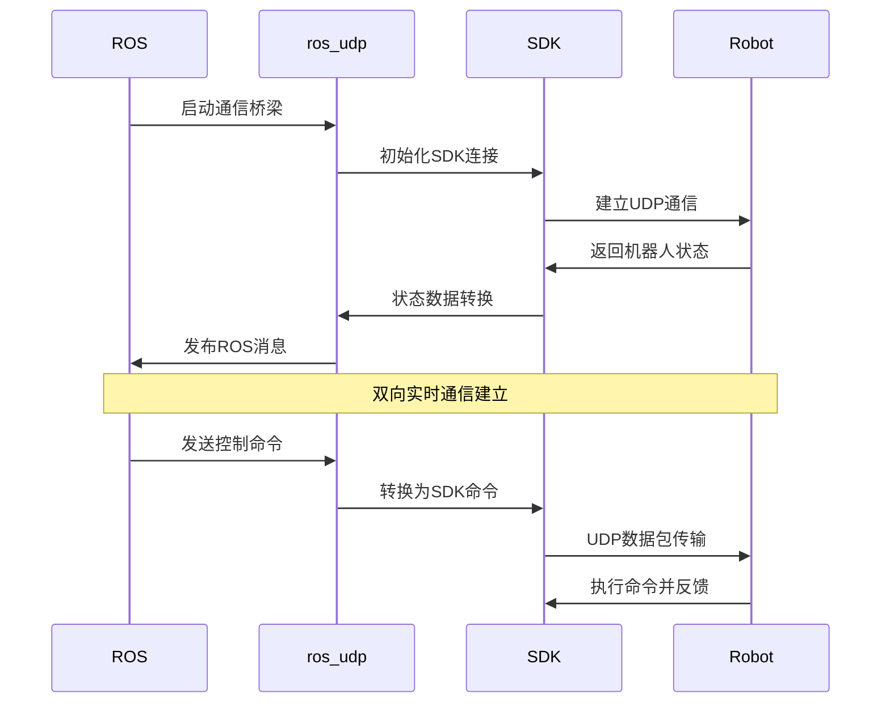

# unitree_ros_to_real 模块详细分析

## 模块概述

`unitree_ros_to_real` 是Unitree四足机器人项目中连接ROS仿真环境与真实机器人硬件的关键桥梁模块。它实现了从仿真到现实的无缝转换，使得在仿真环境中开发的算法可以直接部署到真实机器人上，是整个项目"虚实结合"能力的核心实现。

## 模块基本信息

### 版本信息
- **SDK版本**: v3.8.3
- **支持机器人**: B1 (最新版本)
- **环境要求**: Ubuntu 20.04 + ROS Noetic
- **架构支持**: x86_64 (amd64) / aarch64 (arm64)

### 位置与结构
```
unitree_ros_to_real/
├── README.md                   # 模块使用说明
├── unitree_legged_msgs/        # 🔴 消息定义包(已分析)
└── unitree_legged_real/        # 🔴 真实机器人接口包
    ├── CMakeLists.txt          # 构建配置
    ├── package.xml             # 包依赖声明
    ├── launch/
    │   └── real.launch         # 真实机器人启动文件
    ├── include/
    │   └── convert.h           # ROS消息与SDK数据转换
    ├── src/exe/                # 可执行程序源码
    │   ├── ros_udp.cpp         # ROS-UDP通信桥梁
    │   ├── example_walk.cpp    # 高层控制示例
    │   └── example_position.cpp # 底层控制示例
    └── unitree_legged_sdk/     # Unitree官方SDK
        ├── lib/cpp/            # SDK库文件
        │   ├── amd64/          # x86_64架构库
        │   └── arm64/          # ARM64架构库
        ├── include/            # SDK头文件
        └── example/            # SDK原生示例
```

### 依赖关系分析
```cmake
find_package(catkin REQUIRED COMPONENTS
    roscpp                  # ROS C++接口
    geometry_msgs           # 几何消息
    unitree_legged_msgs     # 🔴 核心依赖：Unitree消息定义
)

# 外部依赖
depend: eigen               # 线性代数库
depend: unitree_legged_sdk  # 🔴 核心依赖：Unitree官方SDK
```

**依赖级别**: 🔴 **第2层 - 底层控制层** - 直接依赖消息基础，为上层提供硬件接口

## 核心功能架构

### 1. 双架构编译支持

#### 自动架构检测
```cmake
message("-- CMAKE_SYSTEM_PROCESSOR: ${CMAKE_SYSTEM_PROCESSOR}")
if("${CMAKE_SYSTEM_PROCESSOR}" MATCHES "x86_64.*")
  set(ARCH amd64)          # x86_64架构
else()
  set(ARCH arm64)          # ARM64架构(机器人板载电脑)
endif()

# 动态链接对应架构的SDK库
link_directories(${CMAKE_SOURCE_DIR}/unitree_legged_sdk/lib/cpp/${ARCH})
set(EXTRA_LIBS -pthread libunitree_legged_sdk.so)
```

**架构适配特性**:
- **开发环境**: x86_64 (PC端开发调试)
- **部署环境**: ARM64 (机器人板载计算机)
- **一套代码**: 自动适配不同架构
- **性能优化**: `-O3 -fPIC` 编译优化

### 2. 核心可执行程序

#### `ros_udp` - ROS-UDP通信桥梁
```cmake
add_executable(ros_udp src/exe/ros_udp.cpp)
target_link_libraries(ros_udp ${EXTRA_LIBS} ${catkin_LIBRARIES})
```

**功能定位**:
- **通信中枢**: ROS话题与UDP Socket之间的转换器
- **协议转换**: ROS消息格式 ↔ Unitree SDK协议
- **实时通信**: 高频率的双向数据传输
- **多控制模式**: 支持高层和底层控制切换

#### `example_walk` - 高层控制示例
```cmake
add_executable(example_walk src/exe/example_walk.cpp)
```

**功能特性**:
- **步态控制**: 多种步态模式切换
- **姿态调整**: 身体高度、欧拉角控制
- **运动控制**: 速度、方向、转向控制
- **状态机**: 时间序列的复杂动作规划

#### `example_position` - 底层控制示例
```cmake
add_executable(example_position src/exe/example_position.cpp)
```

**功能特性**:
- **关节级控制**: 直接控制20个电机
- **位置控制**: 精确的关节位置命令
- **安全机制**: 需要特定的解锁操作序列
- **低级接口**: 访问传感器原始数据

### 3. 启动文件系统 (`real.launch`)

#### 参数化控制模式
```xml
<arg name="ctrl_level" default="highlevel"/>

<node pkg="unitree_legged_real" type="ros_udp" name="node_ros_udp" output="screen" 
      args="$(arg ctrl_level)"/>

<param name="control_level" value="$(arg ctrl_level)"/>
```

**控制级别支持**:
- **highlevel**: 高层运动控制模式
- **lowlevel**: 底层关节控制模式
- **参数传递**: 通过命令行参数传递给ros_udp程序

### 4. 消息转换系统 (`convert.h`)

#### 转换函数架构
```cpp
// ROS消息 → Unitree SDK命令
UNITREE_LEGGED_SDK::MotorCmd rosMsg2Cmd(const unitree_legged_msgs::MotorCmd &msg);
UNITREE_LEGGED_SDK::LowCmd rosMsg2Cmd(const unitree_legged_msgs::LowCmd &msg);
UNITREE_LEGGED_SDK::HighCmd rosMsg2Cmd(const unitree_legged_msgs::HighCmd &msg);
UNITREE_LEGGED_SDK::BmsCmd rosMsg2Cmd(const unitree_legged_msgs::BmsCmd &msg);
UNITREE_LEGGED_SDK::LED rosMsg2Cmd(const unitree_legged_msgs::LED &msg);

// Unitree SDK状态 → ROS消息
unitree_legged_msgs::MotorState state2rosMsg(UNITREE_LEGGED_SDK::MotorState &state);
unitree_legged_msgs::LowState state2rosMsg(UNITREE_LEGGED_SDK::LowState &state);
unitree_legged_msgs::HighState state2rosMsg(UNITREE_LEGGED_SDK::HighState &state);
unitree_legged_msgs::BmsState state2rosMsg(UNITREE_LEGGED_SDK::BmsState &state);
unitree_legged_msgs::IMU state2rosMsg(UNITREE_LEGGED_SDK::IMU &state);
unitree_legged_msgs::Cartesian state2rosMsg(UNITREE_LEGGED_SDK::Cartesian &state);
```

#### 转换特性分析
- **双向转换**: 完整的输入输出数据流转换
- **类型匹配**: 精确的数据类型映射
- **批量处理**: 支持数组和复合数据结构转换
- **数据完整性**: 包含校验、版本、保留字段的完整转换

### 5. Unitree SDK集成

#### SDK版本特性
```cpp
// v3.8.3 特性
- C++14 标准
- 支持B1机器人
- 多架构支持: amd64/arm64
- 优化的通信协议
- 完整的示例程序集
```

#### SDK库结构
```
unitree_legged_sdk/
├── lib/cpp/
│   ├── amd64/libunitree_legged_sdk.so     # x86_64库
│   └── arm64/libunitree_legged_sdk.so     # ARM64库
├── include/
│   └── unitree_legged_sdk.h               # SDK主头文件
└── example/
    ├── example_walk.cpp                   # 步行控制示例
    ├── example_position.cpp               # 位置控制示例
    ├── example_velocity.cpp               # 速度控制示例
    └── example_torque.cpp                 # 力矩控制示例
```

## 使用方法与工作流程

### 1. 标准使用流程

#### 高层控制模式
```bash
# 1. 启动ROS-UDP桥梁 (高层控制)
roslaunch unitree_legged_real real.launch ctrl_level:=highlevel

# 2. 运行步行控制示例
rosrun unitree_legged_real example_walk
```

#### 底层控制模式
```bash
# 1. 启动ROS-UDP桥梁 (底层控制)
roslaunch unitree_legged_real real.launch ctrl_level:=lowlevel

# 2. 机器人准备操作 (重要!)
# - 按L2+A让机器人坐下
# - 按L1+L2+start进入底层控制模式
# - 确保机器人悬挂固定

# 3. 运行位置控制示例
rosrun unitree_legged_real example_position
```

### 2. 系统启动时序


### 3. 数据流向分析

#### 命令流向 (ROS → Robot)
```
ROS应用 → ROS话题 → ros_udp → convert转换 → SDK命令 → UDP通信 → 机器人硬件
```

#### 状态反馈流向 (Robot → ROS)
```
机器人硬件 → UDP通信 → SDK状态 → convert转换 → ros_udp → ROS话题 → ROS应用
```

#### 支持的消息类型
**输入消息**:
- `unitree_legged_msgs::HighCmd` - 高层运动控制
- `unitree_legged_msgs::LowCmd` - 底层关节控制
- `unitree_legged_msgs::MotorCmd` - 单个电机控制

**输出消息**:
- `unitree_legged_msgs::HighState` - 高层状态反馈
- `unitree_legged_msgs::LowState` - 底层状态反馈
- `unitree_legged_msgs::MotorState` - 电机状态反馈

## 控制模式详细分析

### 1. 高层控制模式 (High Level)

#### 适用场景
- **日常导航**: 在已知环境中移动
- **基础步态**: 走路、小跑、站立等
- **用户友好**: 直观的速度和方向控制
- **安全性高**: 内置的稳定性保证

#### 控制接口
```cpp
// 示例控制命令
high_cmd_ros.mode = 2;              // 步行模式
high_cmd_ros.gaitType = 1;          // 步态类型
high_cmd_ros.velocity[0] = 0.3;     // 前进速度
high_cmd_ros.velocity[1] = 0.0;     // 侧向速度
high_cmd_ros.yawSpeed = 0.2;        // 偏航角速度
high_cmd_ros.footRaiseHeight = 0.1; // 足部抬起高度
high_cmd_ros.bodyHeight = 0.0;      // 身体高度
```

#### 状态反馈
```cpp
// 可获取的状态信息
high_state.position[3];          // 机器人位置
high_state.velocity[3];          // 机器人速度
high_state.footForce[4];         // 四足接触力
high_state.footPosition2Body[4]; // 足端相对身体位置
high_state.rangeObstacle[4];     // 障碍物距离
```

### 2. 底层控制模式 (Low Level)

#### 适用场景
- **高精度控制**: 需要精确关节控制的场景
- **算法开发**: 自定义步态和平衡算法
- **研究应用**: 机器人学研究和实验
- **特殊任务**: 需要非标准运动的场景

#### 安全操作序列
```bash
1. L2 + A          # 让机器人坐下
2. L1 + L2 + start # 进入底层控制模式
3. 物理固定        # 确保机器人悬挂或固定
4. 启动控制程序    # 运行底层控制代码
```

#### 控制接口
```cpp
// 20个电机的精确控制
for(int i = 0; i < 20; i++) {
    low_cmd.motorCmd[i].mode = 0x0A;  // 位置控制模式
    low_cmd.motorCmd[i].q = target_pos[i];    // 目标位置
    low_cmd.motorCmd[i].dq = 0;               // 目标速度
    low_cmd.motorCmd[i].Kp = position_gain;   // 位置增益
    low_cmd.motorCmd[i].Kd = velocity_gain;   // 速度增益
    low_cmd.motorCmd[i].tau = 0;              // 前馈力矩
}
```

## 与其他模块的接口关系

### 1. 与仿真系统的一致性

#### 消息接口统一
```cpp
// 相同的消息类型在仿真和真实环境中使用
unitree_legged_msgs::LowCmd    // 仿真和真实都使用
unitree_legged_msgs::LowState  // 仿真和真实都使用
unitree_legged_msgs::HighCmd   // 仿真和真实都使用
```

#### 代码复用性
```bash
# 同一套ROS代码可以无缝切换
roslaunch unitree_gazebo normal.launch        # 仿真模式
# vs
roslaunch unitree_legged_real real.launch     # 真实机器人模式
```

### 2. 与上层应用的集成

#### 导航系统集成
```cpp
// unitree_navigation可以直接与真实机器人通信
geometry_msgs::Twist cmd_vel;  // 标准ROS速度命令
// 通过消息转换器自动转换为Unitree格式
```

#### 控制器兼容
```cpp
// unitree_controller的控制逻辑可以直接应用
// 只需要将输出重定向到真实机器人话题
```

### 3. 与机器人描述的关联
- **参数共享**: 使用相同的机器人模型参数
- **坐标系统一**: 保持相同的坐标系定义
- **物理特性**: 质量、惯量等参数保持一致

## 技术特性与限制

### 1. 性能特性
- **实时通信**: UDP协议保证低延迟
- **高频控制**: 支持高达1000Hz的控制频率
- **数据完整性**: CRC校验保证通信可靠性
- **多线程**: 支持并发的收发操作

### 2. 安全机制
- **模式切换**: 明确的控制模式分离
- **硬件保护**: 底层控制需要物理安全措施
- **软件限制**: SDK内置的安全限制
- **紧急停止**: 支持紧急停止功能

### 3. 兼容性限制
- **SDK版本**: 特定版本对应特定机器人型号
- **架构要求**: 需要对应的硬件架构支持
- **网络要求**: 需要可靠的网络连接
- **权限要求**: 部分功能需要管理员权限

## 部署与调试建议

### 1. 环境配置
```bash
# 1. 确保SDK库路径正确
ls ${CMAKE_SOURCE_DIR}/unitree_legged_sdk/lib/cpp/${ARCH}/

# 2. 检查网络连接
ping [机器人IP地址]

# 3. 验证权限设置
sudo ./ros_udp  # 某些操作需要sudo权限
```

### 2. 调试技巧
```bash
# 1. 监控ROS话题
rostopic echo /unitree_low_state
rostopic echo /unitree_high_state

# 2. 检查消息转换
rostopic pub /unitree_low_cmd unitree_legged_msgs/LowCmd [...]

# 3. 观察UDP通信
sudo tcpdump -i eth0 port 8080  # 监控UDP数据包
```

### 3. 常见问题解决
- **连接失败**: 检查IP地址和网络配置
- **权限错误**: 使用sudo运行或调整用户权限
- **库文件缺失**: 确认SDK库文件架构匹配
- **控制无响应**: 检查机器人状态和控制模式

## 在项目中的核心地位

### 🎯 **虚实转换的关键桥梁**
`unitree_ros_to_real` 实现了整个项目最重要的功能：
- **仿真验证**: 算法在仿真中验证
- **真实部署**: 无缝迁移到真实机器人
- **一致接口**: 保持相同的ROS消息接口
- **降低风险**: 减少真实机器人测试的风险

### 🔧 **项目商业化的使能器**
- **产品化基础**: 从研究原型到实际产品的关键环节
- **用户友好**: 提供标准的ROS接口给最终用户
- **可靠性保证**: 工业级的通信和安全机制

### 📈 **技术生态的连接器**
- **ROS生态**: 连接ROS庞大的算法库和工具链
- **Unitree生态**: 接入Unitree的硬件和底层软件
- **开发效率**: 大幅提升从研发到部署的效率

## 总结

`unitree_ros_to_real` 模块是整个Unitree四足机器人项目的"现实化引擎"，具有以下关键特性：

### 🔴 **核心功能**
1. **虚实桥梁**: 实现仿真环境到真实机器人的无缝转换
2. **双模控制**: 支持高层运动控制和底层关节控制
3. **完整转换**: 提供ROS消息与Unitree SDK的完整双向转换
4. **多架构支持**: 支持开发环境(x86_64)和部署环境(ARM64)

### 🟡 **架构特点**
1. **分层设计**: 清晰的高层/底层控制模式分离
2. **实时通信**: 基于UDP的高频、低延迟通信
3. **安全机制**: 完善的模式切换和安全保护
4. **标准接口**: 保持与仿真环境一致的ROS接口

### 🟢 **在项目中的地位**
- **商业化关键**: 从研究原型到实际产品的必要环节
- **生态连接**: ROS开源生态与Unitree商业生态的桥梁
- **风险控制**: 通过仿真验证降低真实机器人测试风险

该模块将整个项目从"仿真研究"提升到"实用产品"的层次，是项目价值实现的关键组件。