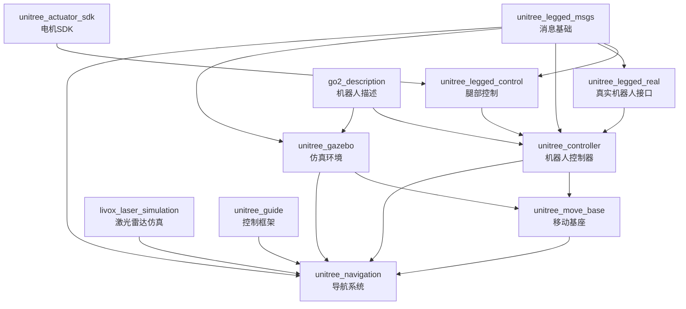

# Unitree四足机器人项目模块耦合关系分析

## 项目概述

本文档详细分析了Unitree四足机器人自主建图导航项目中各个模块之间的耦合关系，为开发者理解系统架构和模块依赖提供参考。

## 项目模块列表

### 核心功能模块
- `unitree_navigation` - 完整导航系统
- `unitree_guide` - 核心控制框架
- `unitree_controller` - 机器人控制器
- `unitree_gazebo` - 仿真环境
- `unitree_legged_control` - 腿部控制

### 基础支撑模块
- `unitree_ros_to_real` - 真实机器人接口
- `robots` - 机器人描述文件
- `livox_laser_simulation` - 激光雷达仿真

## 模块分层架构

### 第0层 - 消息基础层

#### `unitree_legged_msgs`
- **位置**: `unitree_ros_to_real/unitree_legged_msgs/`
- **功能**: 定义机器人通信消息类型
- **依赖**: 
  - `std_msgs`
  - `geometry_msgs` 
  - `sensor_msgs`
- **消息类型**:
  - `MotorCmd.msg` / `MotorState.msg` - 电机控制与状态
  - `LowCmd.msg` / `LowState.msg` - 底层控制命令与状态
  - `HighCmd.msg` / `HighState.msg` - 高层控制命令与状态
  - `IMU.msg` - 惯性测量单元数据
  - `BmsCmd.msg` / `BmsState.msg` - 电池管理系统

**重要性**: 🔴 **核心基础** - 几乎所有其他模块都依赖此包

### 第1层 - 硬件抽象层

#### `unitree_actuator_sdk`
- **位置**: `unitree_guide/unitree_actuator_sdk/`
- **功能**: 电机控制SDK
- **依赖**: 
  - `roscpp`
  - Unitree电机SDK库
- **耦合度**: 🟢 **低耦合** - 相对独立的硬件接口

#### `go2_description`
- **位置**: `robots/go2_description/`
- **功能**: Go2机器人URDF描述
- **依赖**: 
  - `catkin`
  - `roslaunch`
- **耦合度**: 🟢 **低耦合** - 仅提供机器人模型描述

### 第2层 - 底层控制层

#### `unitree_legged_control`
- **功能**: 机器人关节级控制
- **依赖**:
  - 🔴 `unitree_legged_msgs`
  - `controller_interface`
  - `hardware_interface`
  - `pluginlib`
- **耦合度**: 🟡 **中等耦合** - 依赖核心消息包

#### `unitree_legged_real`
- **位置**: `unitree_ros_to_real/unitree_legged_real/`
- **功能**: 真实机器人硬件接口
- **依赖**:
  - 🔴 `unitree_legged_msgs`
  - `geometry_msgs`
  - Unitree腿部SDK
- **耦合度**: 🟡 **中等耦合** - 连接ROS与真实硬件

### 第3层 - 中层控制层

#### `unitree_controller`
- **功能**: 机器人整体运动控制
- **依赖**:
  - 🔴 `unitree_legged_msgs`
  - `gazebo_ros`
  - `controller_manager`
  - `joint_state_controller`
- **耦合度**: 🔴 **高耦合** - 核心控制组件

#### `unitree_gazebo`
- **功能**: Gazebo仿真环境和插件
- **依赖**:
  - 🔴 `unitree_legged_msgs`
  - `gazebo_ros`
  - `controller_manager`
- **插件**:
  - `unitreeFootContactPlugin` - 足端接触检测
  - `unitreeDrawForcePlugin` - 力可视化
- **耦合度**: 🔴 **高耦合** - 与控制器紧密集成

### 第4层 - 独立功能层

#### `livox_laser_simulation`
- **功能**: Livox激光雷达仿真插件
- **依赖**:
  - `tf`
  - `gazebo`
- **耦合度**: 🟢 **低耦合** - 相对独立的传感器仿真

### 第5层 - 导航规划层

#### `unitree_move_base`
- **位置**: `unitree_guide/unitree_move_base/`
- **功能**: 移动基座和路径规划
- **依赖**:
  - `move_base_msgs`
  - `geometry_msgs`
  - `visualization_msgs`
- **配置文件**:
  - `costmap_common_params.yaml`
  - `global_costmap_params.yaml`
  - `local_costmap_params.yaml`
  - `base_local_planner_params.yaml`
- **耦合度**: 🟡 **中等耦合** - 标准ROS导航栈

#### `unitree_guide`
- **位置**: `unitree_guide/unitree_guide/`
- **功能**: 核心控制框架和状态机
- **依赖**:
  - Unitree腿部SDK
  - 控制组件库
- **架构**: FSM (有限状态机) 控制框架
- **耦合度**: 🔴 **高耦合** - 核心决策系统

### 第6层 - 应用集成层

#### `unitree_navigation`
- **功能**: 完整的导航系统集成
- **依赖**:
  - 🔴 `unitree_legged_msgs`
  - `move_base_msgs`
  - `actionlib`
  - `pcl_ros`
  - `tf2_ros`
  - FAST-LIO (外部依赖)
- **主要功能**:
  - 遥控建图模式
  - 自主导航模式
  - 路径记录与回放
  - 地图自动检测
- **耦合度**: 🔴 **最高耦合** - 集成所有底层模块

## 耦合关系图



## Launch文件交叉引用关系

### 仿真启动链
```
gazebo_move_base.launch
    ↓ includes
empty_world.launch (gazebo)
    ↓ includes  
set_ctrl.launch (unitree_controller)
```

### 导航启动链
```
unitree_navigation.launch
    ↓ includes
move_base.launch (unitree_move_base)
    ↓ loads configs
costmap_params.yaml + planner_params.yaml
```

## 依赖强度分析

### 🔴 强依赖 (Strong Coupling)
- **`unitree_legged_msgs`** ← 几乎所有模块
- **`unitree_controller`** ↔ **`unitree_gazebo`** (双向依赖)
- **`unitree_navigation`** ← 所有底层模块

### 🟡 中等依赖 (Medium Coupling)  
- **`unitree_legged_control`** ← **`unitree_legged_msgs`**
- **`unitree_move_base`** ← ROS导航栈
- **`unitree_guide`** ← Unitree SDK

### 🟢 弱依赖 (Loose Coupling)
- **`livox_laser_simulation`** ← 仅tf依赖
- **`go2_description`** ← 仅catkin依赖
- **`unitree_actuator_sdk`** ← 仅ROS基础依赖

## 模块部署建议

### 最小仿真环境
```bash
# 必需模块
unitree_legged_msgs/
unitree_controller/
unitree_gazebo/
robots/go2_description/
```

### 完整导航系统
```bash
# 需要所有模块
unitree_legged_msgs/
unitree_controller/
unitree_gazebo/
unitree_navigation/
unitree_guide/
robots/go2_description/
livox_laser_simulation/
```

### 真实机器人部署
```bash
# 核心模块
unitree_legged_msgs/
unitree_ros_to_real/
unitree_controller/
unitree_navigation/
unitree_guide/
```

## 开发注意事项

### 修改影响范围

1. **修改 `unitree_legged_msgs`**
   - 🚨 **高风险** - 影响所有依赖模块
   - 需要重新编译整个项目

2. **修改 `unitree_controller`**
   - 🟡 **中等风险** - 影响仿真和导航功能
   - 需要测试仿真环境

3. **修改 `unitree_navigation`**
   - 🟢 **低风险** - 仅影响导航功能
   - 相对安全的修改点

### 模块替换可能性

- ✅ **可替换**: `livox_laser_simulation`, `go2_description`
- ⚠️ **部分可替换**: `unitree_move_base`, `unitree_gazebo`  
- ❌ **不可替换**: `unitree_legged_msgs`, `unitree_controller`

## 总结

该项目采用了**高度集成的紧耦合架构**，各模块之间存在显著的依赖关系。核心特点：

1. **`unitree_legged_msgs`** 是整个系统的通信基础
2. **控制层与仿真层紧密集成**，便于开发测试
3. **导航层集成度高**，提供完整解决方案
4. **模块化程度适中**，便于功能扩展但增加了系统复杂度

这种架构设计适合于专门的Unitree机器人应用开发，但在跨平台移植时需要考虑依赖关系的处理。